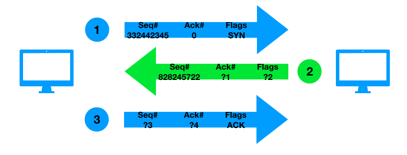
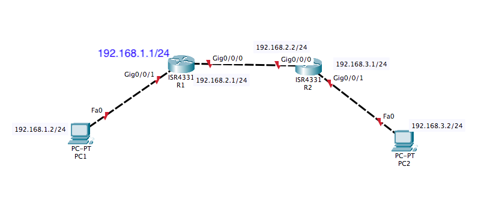

# CSCI 270 Spring 2022
# Homework 3
# Due: 11:59pm 03/10/2022

## Q1: (5 points)
Switches only work on layer 2.
+ A. true
+ B. false

## Q2: 

 (10 points)

Finish the process of three-way handshake, you can write the answer as: 
?1 = your answer 
?2 = your answer 
?3 = your answer 
?4 = your answer 

## Q3: (5 points)
Which protocol’s header would a Layer 4 device read and process?
+ A. IP
+ B. TCP
+ C. ARP
+ D. HTTP

## Q4: (5 points)
What kind of route is created when a network administrator configures a router to use a specific path between nodes?
+ A. Trace route
+ B. Static route
+ C. Default route
+ D. Best path

## Q5: (10 points)
When a router can’t determine a path to a message‘s destination, where does it send the message?
+ A. Default gateway
+ B. Routing table
+ C. Administrative distance
+ D. Gateway of last resort

## Q6: (10 points)
A routing protocol’s reliability and priority are rated by what measurement?
+ A. Routing table
+ B. MTU
+ C. Latency
+ D. AD

## Q7: (5 points)
Which routing protocol does an exterior router use to collect data to build its routing tables?
 + A. RIPv2
 + B. BGP
 + C. OSPF
 + D. IP

## Q8: (20 points):
Complete the static routing tables for the two routers in the following network, you need to show the whole process of getting the routing tables, you can choose to start from either router.

## Q9: (30 points)
Use CISCO Packet Trace to construct the network in Q8, add the static routing entries to the routers, so that the communication between any two ports is available(I will use `ping` to randomly test 3 pairs of ports, 10 points for each pair ).

# Step 1: Save your answers for Q1-Q8 in a PDF file, name it as 'CSCI270_Homework3_JohnDoe(012345467).pdf' 
    (You can write down your answer in any text edit and print it as a pdf file later.)
# Step 2: create and save your cisco packet tracer project as 'CSCI270_Homework3_JohnDoe(012345467).pkt'

# Step 3: Zip the previous two files as one archive, name it as 'CSCI270_Homework3_JohnDoe(012345467)'

# Step 4: Submit your archive file on [Blackboard](https://blackboard.sau.edu)
