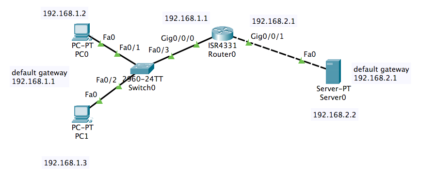
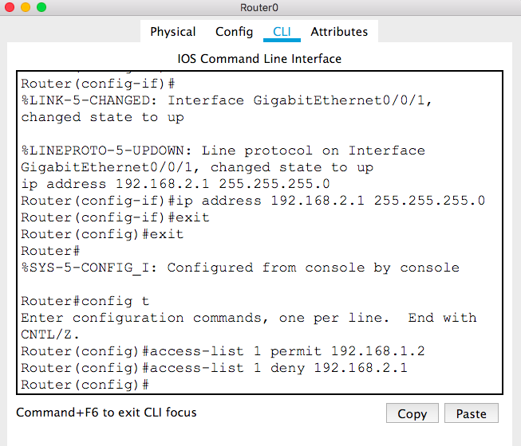
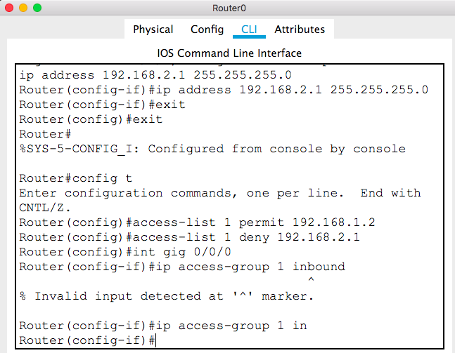

# Chapter 10 Lab: ACL
## Packet Tracer Standard Access List Configuration

There are three types Access Lists in common:
+ **Standard Access List**
  - 1~99
  - applied closest to the destination
  - deny or permit source IPs
+ Extended Access List
  - 100~199
  - applied closest to the source
  - deny or permit source IPs
  - deny or permit destination IPs
  - deny or permit ports(services)
+ Named Access List

## Step 1: Configure the following topology

## Step 2: configure the Standard Access-List on router

For our Standard Access-List, we can use the ACL Number 1 to 99. These numbers can be 100 to 199, if you use extended ACLs.
+ We permit PC0 and deny PC1.

## Step 3: pplying Standard Access-List to the Interface

+ We apply the ACL list to interface Gig 0/0/0.
+ We apply the ACL list to the inbound message(if you want to apply it to the outbound message, use value `out` instead of `in`).

+ Then you can use the `ping` command to check if the ACL is working on interface gig 0/0/0 for the incoming messages.
