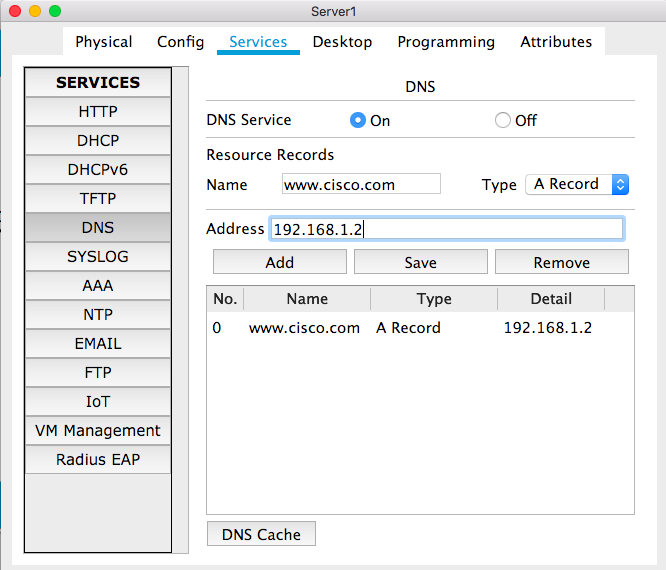
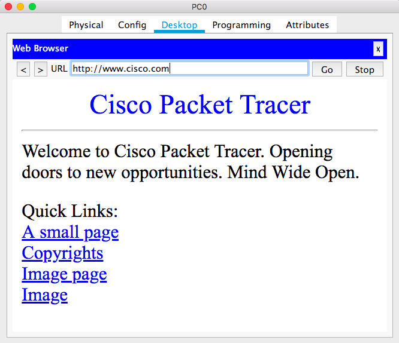

# CSCI 270
# Chapter 3
# Lab: DNS server

## Step 1: Construct the following network
+ PC:
  - IP: 192.168.1.1/24
  - DNS Server: 192.168.1.3(You can find it in PC0->Config->Settings)
  - You can set IP and DNS Server in the same place. (PC0->Desktop->IP Configuration)
+ Web Server
  - IP: 192.168.1.2/24
  - DNS Server: 192.168.1.3(You can find it in Server0->Config->Settings)

+ DNS Server
  - IP: 192.168.1.3/24
  - DNS Services: add `Name` and `Address`, click on `Add`. (You can find it in Server1->Services->DNS) 
  
  
  
## Step 2: Visit Website

+ Note:
  - You can use a different website name.
  - If you want to change the website content, you can edit the `index.html` in `Server0->Services->HTTP`.
