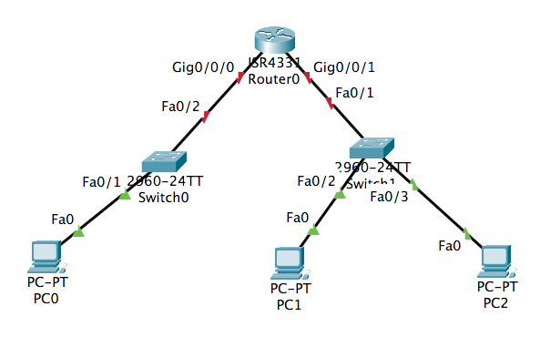
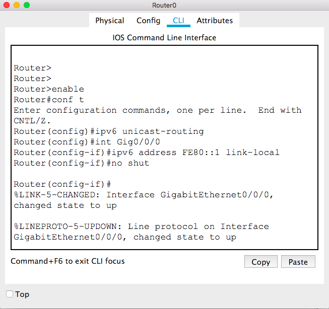
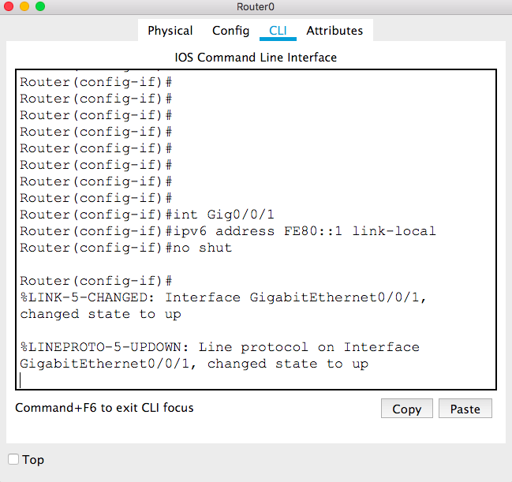

# CSCI 270 
# Chpater 3
# Lab: IPv6

## Step 1: Create the following network
+ Then we can use the the `Link Local Address` directly on a local area network.
+ `PC->Config->FastEthernet0->Link Local Address` to find the link local address, then use the ping command to check the connection between PCs on the same LAN.
+ Note that you may have a different IPv6 address.
~~~~
ping FE80::205:5EFF:FEB5:9E57
~~~~

## Step 2: Set up link local address for Router0
Note:
+ Choose the correct mode
+ Command `ipv6 unicast-routing` enables unicast on the router (disabled by default)
+ Command `ipv6 address FE80::1 link-local` adds the local link address `FE80::1` to interface chosen by `ini Gig0/0/0`
  - We choose `FE80::1` because it is easy to remember. You can choose a different one.
+ Command `no shut` is equivalent to `check on port status manually`.

+ For intercace Gig0/0/1, repeat the same commands.
  - We can use the same local link address `FE80::1` because a local link address is only significant locally.

+ Then you can use the ping command to check the connections between a PC and the router.

## Set up Global Unicast Addresses (Not done yet)
