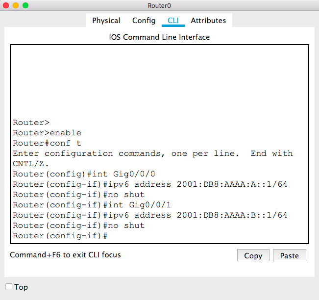
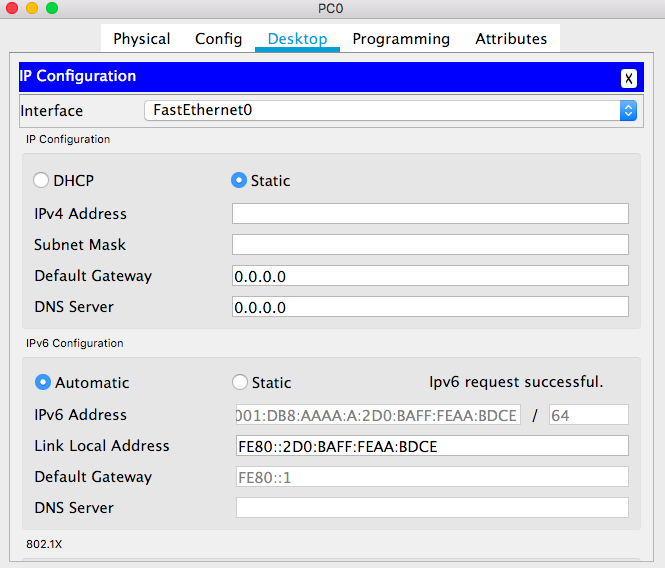

# CSCI 270 
# Chpater 3
# Lab: IPv6

## Step 1: Create the following network
+ Then we can use the the `Link Local Address` directly on a link( IPv6 local area network).
+ `PC->Config->FastEthernet0->Link Local Address` to find the link local address, then use the ping command to check the connection between PCs on the same LAN.
+ Note that you may have a different IPv6 address.
~~~~
ping FE80::205:5EFF:FEB5:9E57
~~~~

## Step 2: Set up link local address for Router0
Note:
+ Choose the correct mode
+ Command `ipv6 unicast-routing` enables unicast on the router (disabled by default)
+ Command `ipv6 address FE80::1 link-local` adds the local link address `FE80::1` to interface chosen by `ini Gig0/0/0`
  - We choose `FE80::1` because it is easy to remember. You can choose a different one.
+ Command `no shut` is equivalent to `check on port status manually`.

+ For intercace Gig0/0/1, repeat the same commands.
  - We can use the same local link address `FE80::1` because a local link address is only significant locally.

+ Then you can use the ping command to check the connections between a PC and the router.

## Set up Global Unicast Addresses
+ Global Unicast Addresses are used for communications between different links('IPv6 lans').
+ Assign global unicast address `2001:DB8:AAAA:A::1/64` to router interface `Gig0/0/0`.
  - `2001:DB8:AAAA:A::1` is the compressed version
  - the full address is `2001:0DB8:AAAA:000A:0000:0000:0000:0001`
  - `/64` divides the full address into two parts: network and host.
  - The first 64 bits `2001:0DB8:AAAA:000A` is the network prefix
    + `2001:0DB8`  is the internet registry prefix
    + `AAAA` is the signed prefix (given by an ISP to represent our company)
    + `000A` is the subnet 
  - The last 64 bits `0000:0000:0000:0001` is the host id
+ Assign global unicast address `2001:DB8:AAAA:B::1/64` to router interface `Gig0/0/1`.

+ Use `PC0->Desktop->IP Configuration->IPv6 Configuration->Automatic` to automatically get the IPv6 address and default gateway for PC0.
+ Use `PC1->Desktop->IP Configuration->IPv6 Configuration->Automatic` to automatically get the IPv6 address and default gateway for PC1.
+ Use `PC2->Desktop->IP Configuration->IPv6 Configuration->Automatic` to automatically get the IPv6 address and default gateway for PC2.

+ Then you can ping between different links.
  - e.g.: `ping 2001:DB8:AAAA:B:202:4AFF:FE43:C0DA` from PC0 to PC1.

