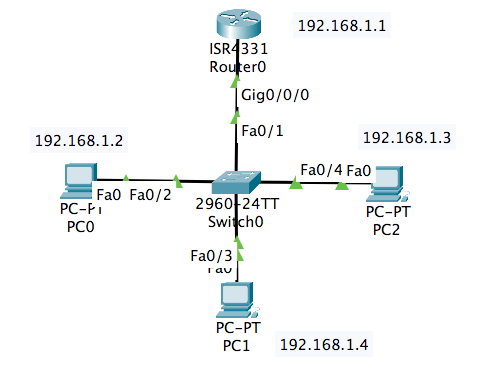
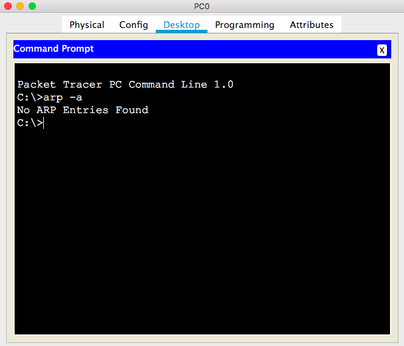
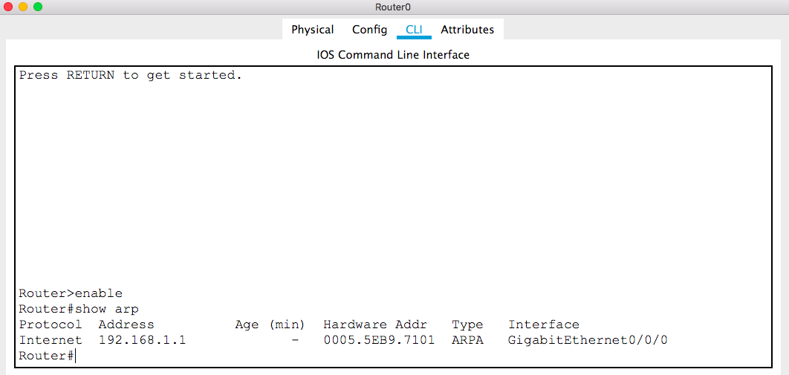
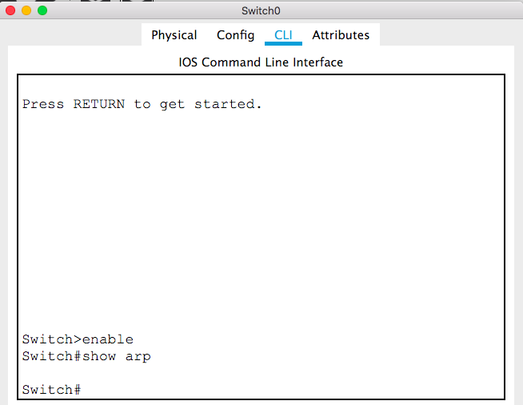
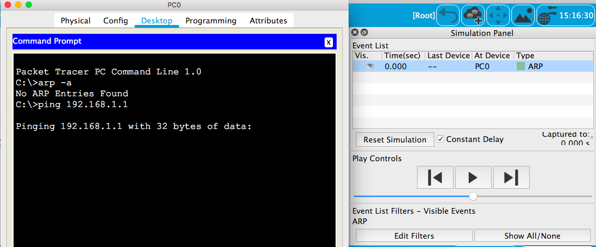
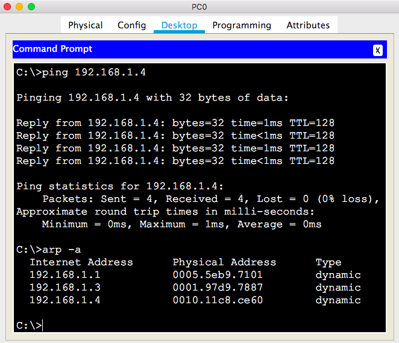
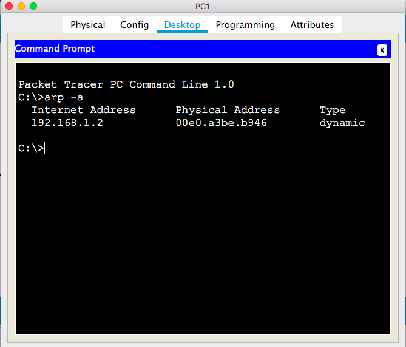
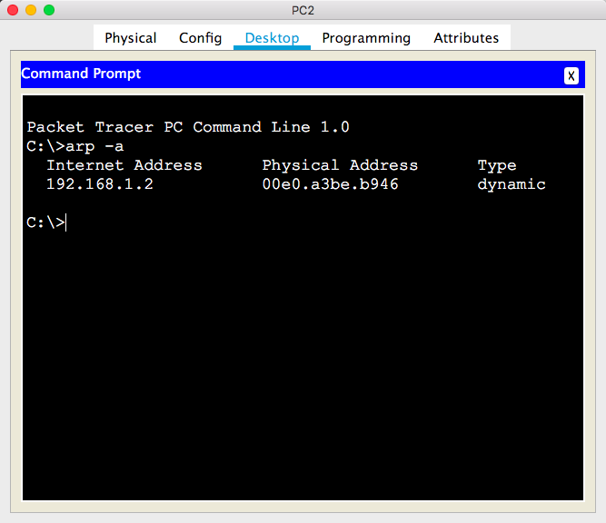
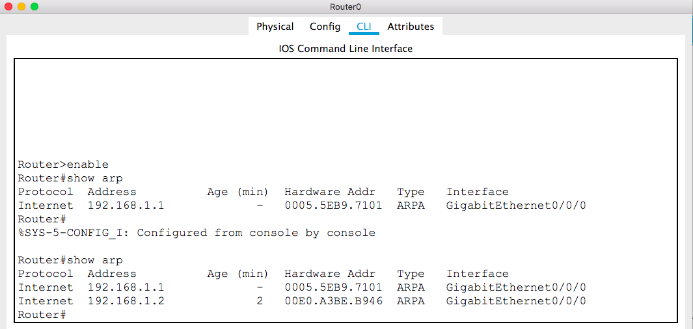
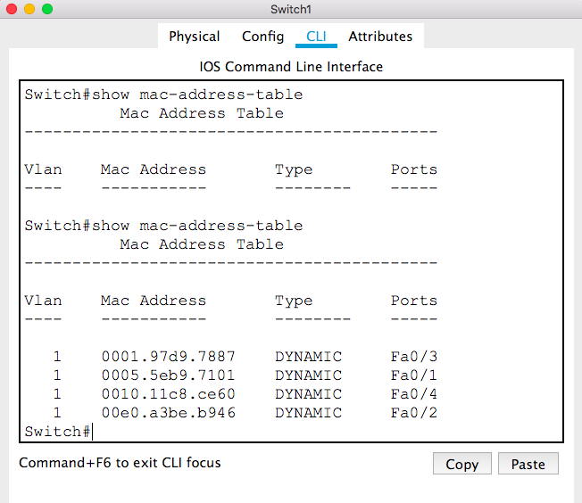

# CSCI270 
# Chapter 4
# Lab: ARP

# Step 1: Create the following network

# Step 1: Use the following command to check the initial ARP tables 
+ use `arp -a` on PCs

+ use `show arp` on Routers

+ use `show mac-address-table` on swtich

+ Note that
  - make sure you change to the correct mode on routers or switches.
  - A switch does not contain an ARP table, only a mac address table.
  
# Step 2: At PC0, ping to the other interfaces
+ Note that you can see the ARP protocol is being used.

~~~~
ping 192.168.1.1
ping 192.168.1.3
ping 192.168.1.4
~~~~

# Step 3: Repeat Step 1

+ PC0

+ PC1

+ PC2

+ Router

+ Switch

+ Please take a look at the difference between PC0's ARP table with other ARP tables.
+ Question: What will happen when the router receives data from another LAN?

