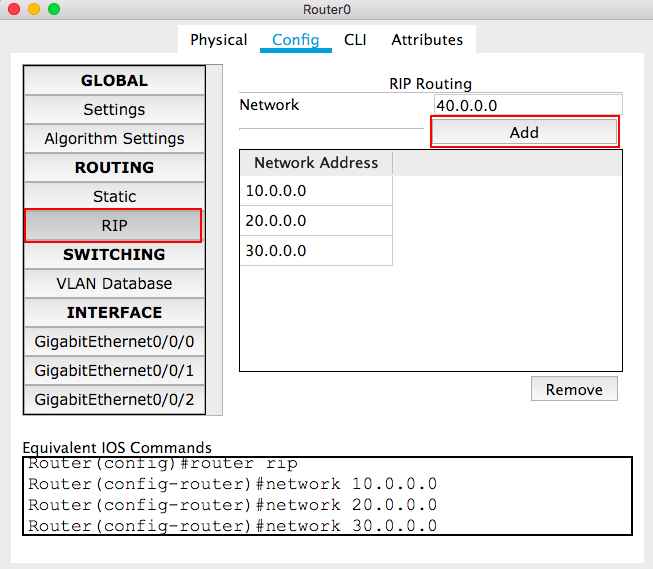

# Chapter 4
# RIP Lab

## Step 1: Repeat Step 1 in [Static Routing Table Lab](CH4-RoutingTable.md)

## Step 2: Repeat Step 2 in [Static Routing Table Lab](CH4-RoutingTable.md)

## Step 3: Add the network IDs to the RIP Routing of each router.
+ You can also do it by the following commands
~~~~
Router>enable
Router#configure terminal
Router(config)#router rip
Router(config-router)#network 10.0.0.0
Router(config-router)#network 20.0.0.0
Router(config-router)#network 30.0.0.0
Router(config-router)#network 40.0.0.0
~~~~

## Step 4: Repeat Step 4 in [Static Routing Table Lab](CH4-RoutingTable.md)
