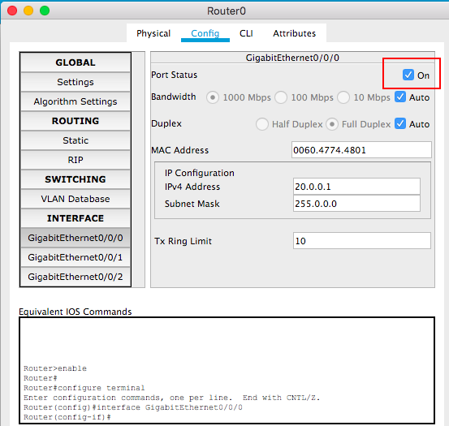

# Lab: Ch4 - Routing Table

# Step 1: Construct the network topology.

Always a good idea to show the port/interface names. Follow the following instruction to do so.

# Step 2: Set up IP/Mask for each port.
+ Do not forget the default gateway.

+ Do not forget to turn on the interfaces we use on routers.

# Step 3: On each router, create the routing table.
+ You do not need to provide the information for the networks that are connected to the router directly(The ones with 0 hop count).
+ You need to enter:
  - Network (ID)
  - (Subnet) Mask
  - Next Hop
  

# Step 4: Use `ping` command to check if the routing tables are working or not.

