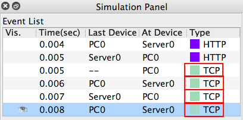

# CSCI270
# Chapter 4
# Lab: TCP

# Step 1: Create the following network.
+ Choose `Simulation` mode
+ Only keep `TCP` protocol

# Step 2: Use the web brower on PC0 to make request to the (web)Server0.

+ Three way handshake
  - Note that the first `HTTP` has not been sent.
  

+ Send the payload

+ Four waves

+ You can compare each event from the even list with the TCP format. 
  - Note that the sequence number in Cisco Packet Tracer starts from 0 instead of a random number.
  - Example: the second handshke
  
  
