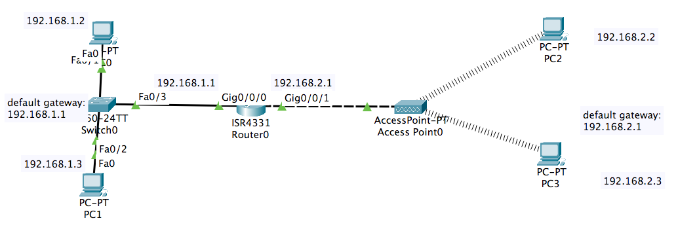

# Chapter 6
# 802.11/WI-FI Frame VS. 802.3/Ethernet Frame

# Construct the following network
+ For `PC2` and `PC3`, follow the similar steps in [WLAN lab](CH6-WLAN.md) to wired `PT-HOST-NM-1CFE` NIC with wireless `WPM300N` module. 

# Compare the difference between 802.11/WI-FI Frame and 802.3/Ethernet Frame
+ ping 192.168.1.3 at 192.168.1.2
+ ping 192.168.2.2 at 192.168.1.2
+ ping 192.168.2.3 at 192.168.2.2
