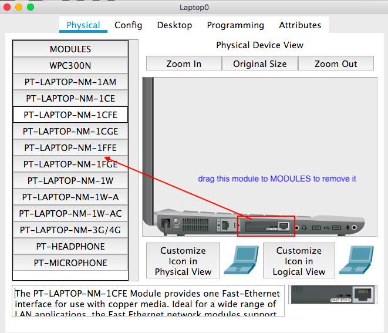

# CSCI 270
# Chapter 6
# Lab: Implementation of Wireless(Wi-Fi) LAN

# Step 1: Construct the following network topology.

+ 1. Wireless router has a default IP: 192.168.0.1/24

+ 2. No wireless connection between laptop and wireless router, because laptops have no wireless modules by default.

+ 3. `Network Devices -> Wireless Devices -> Home Router `To select a wireless router

# Step 2: Change wired module `PT-LAPTOP-NM-1CFE` to wireless module `Linksys-WPC300N`
+ 1. Turn off the power first
  - yellow light -> power is on 

+ 2. Drag the wired module to `MODULES` list on the left. 

+ 3. Add the wireless module

# Step 3: The wireless LAN is done.
+ 1. DHCP by default.
+ 2. You can also use static IP.

