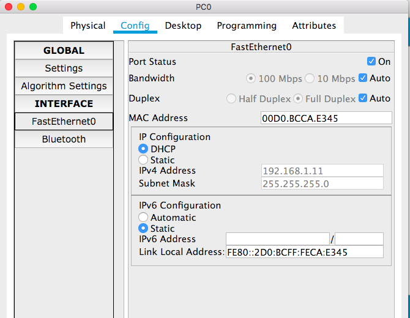

# 1. Configuring DHCP server on a Router.
# Step 1: 
+ Build the network topology
  - a few PCs
  - one switch
  - one router

## Step 2: 
+ On the router, configure interface GigabitEthernet0/0/0 to act as the default gateway for our LAN.
  - I used `192.168.1.1`. You can use other IP addresses here, but correspondingly, you need to change the IP adress for `default-router` command in step 3.

## Step 3: 
+ Configure DHCP server on the Router. In the server we will define a DHCP pool of IP addresses to be assigned to hosts, a Default gateway  for the LAN and a DNS Server.
  - `MY_LAN` is the pool name, you can use whatever name you want.
  - `192.168.1.0 255.255.255.0` is the network `192.168.1.1` is in.
  - `default-router 192.168.1.1` defines the default gateway.
  - `dns-server 192.168.1.10` defines the DNS server. It is not used in this lab. You can also use other IP addresses(either private or public).
  - use `exit` command to exit `config-if` mode
~~~~
Router(config)#
Router(config)#ip dhcp pool MY_LAN
Router(dhcp-config)#network 192.168.1.0 255.255.255.0
Router(dhcp-config)#default-router 192.168.1.1
Router(dhcp-config)#dns-server 192.168.1.10
~~~~

+ We can add ip dhcp excluded-address command to our configuration so as to configure the router to exclude addresses 192.168.1.1 through 192.168.1.10 when assigning addresses to clients. The ip dhcp excluded-address command may be used to reserve addresses that are statically assigned to key hosts(e.g., the dns server in this lab). So add the above command under the global configuration mode.

~~~~
Router(config)#ip dhcp excluded-address 192.168.1.1 192.168.1.10
~~~~

## Step 4:
+ Now go to every PC and on their IP configuration tabs, enable DHCP. Every PC should be able to obtain an IP address, default gateway and DNS server, as defined in step 2.

+ Do this for the other PCs.

# You can find more details [here](https://www.cisco.com/en/US/docs/ios/12_4t/ip_addr/configuration/guide/htdhcpsv.html)

