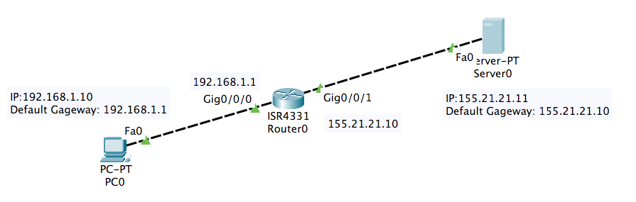
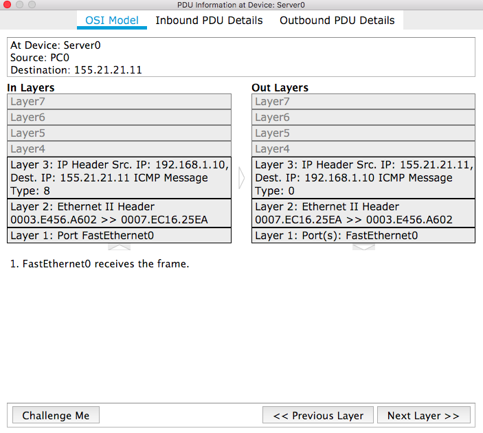
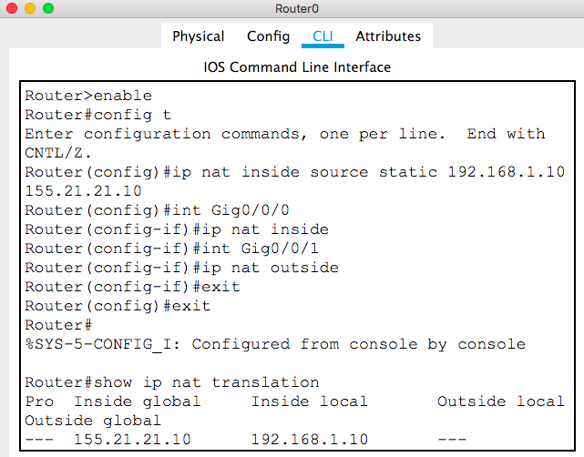
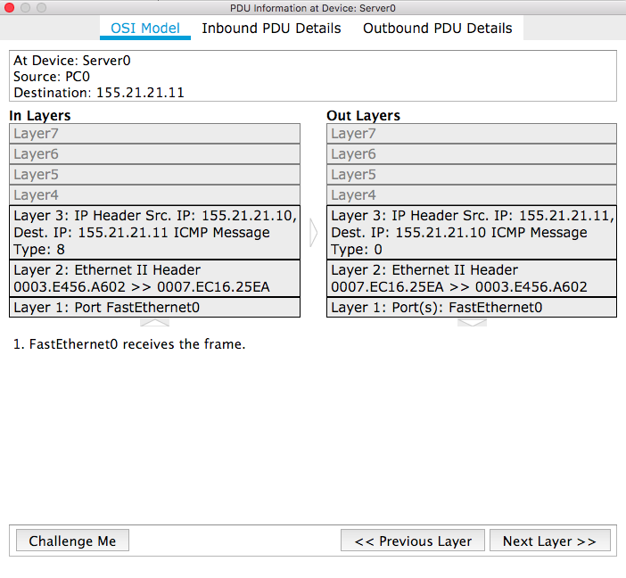

# CSCI 270
# Chapter 3
# Lab: SNAT

# Step 1: Set up the network

# Step 2: Run command `ping 155.21.21.11` at PC0
+ Note, you can see PC0's original IP is used in the ICMP messayge(`Edit Filters` to only keep the ICMP protocol).

# Step 3: Set up SNAT on a router

# Step 4: Run command `ping 155.21.21.11` at PC0 again
+ Note, you can see PC0's orignal IP is replaced by the public IP in the ICMP messayge(`Edit Filters` to only keep the ICMP protocol).

[Understand Router Modes](https://blog.router-switch.com/2012/08/four-modes-to-access-and-configure-a-cisco-router/)
