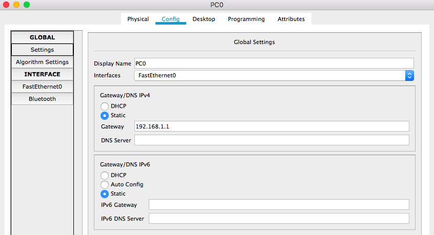

# Lab for chapter 8

## Lab 1: Subnetting with static routing
### Step 1: Divide network `192.168.1.0/24` for the following three subnets
|Subnet|number of hosts|
|----|----|
|1|100|
|2|50|
|3|25|
### Step 2: Create static routing tables on Router 1 and Router 2.
+ Note: 
  - Gig0/0/0 of Router 1 is in subnet 1.
  - Gig0/0/1 of Router 1 and Gig0/0/1 of Router 2 are in subnet 2.
  - Gig0/0/0 of Router 2 is in subnet 3.

## Lab 2: VLAN with one switch
+ PC0 and PC1 in one VLAN(number:1, name:default)
+ PC2 and PC3 in another VLAN(number:20, name:lab1)

### Step 1: set up PCs
+ PC0->Config->Settings->Gateway: 192.168.1.1

+ PC0->Config->FastEthernet0->IP Address: 192.168.1.2
+ PC0->Config->FastEthernet0->Subnet Mask: 255.255.255.0

+ In the same way, we set PC1 with 
  - Gateway: 192.168.1.1
  - IP Address: 192.168.1.3
  - Subnet Mask: 255.255.255.0
+ In the same way, we set PC2 with 
  - Gateway: 192.168.2.1
  - IP Address: 192.168.2.2
  - Subnet Mask: 255.255.255.0
+ In the same way, we set PC3 with 
  - Gateway: 192.168.2.1
  - IP Address: 192.168.2.3
  - Subnet Mask: 255.255.255.0
  
### Step 2: set up the Switch
### Step 2.1 add the new VLAN
+ Switch0->Config->VLAN Database->VLAN Number: 20
+ Switch0->Config->VLAN Database->VLAN name: lab1
+ click **Add**, you will see a new VLAN in the database.

### Step 2.2 choose the right VLAN number for the access ports
+ Note: Fa0/1 has beed assigned to PC0,  Fa0/2 to PC1, Fa0/3 to PC2, Fa0/5 to PC3, and Fa0/5 to the router. You may have differet connections if you you connect those ports in a different order.

+ Switch0->Config->FastEthernet0/1 and Switch0->Config->FastEthernet0/2, you will see the default port type: **Access** and the default VLAN number: **1**.

+ Switch0->Config->FastEthernet0/3 and Switch0->Config->FastEthernet0/4, change the VLAN number to **20**.

### Step 2.3 choose the right port type for the trunk port
+ Switch0->Config->FastEthernet0/5, change the port type to **trunk**.

## Step 3: set up the router
before the set-up, you can try to ping from VLAN1 to VLAN2O
## Step 3.1: set up GigabitEthernet0/0/0
+ Router0->Config->GigabitEthernet0/0/0->port status: on
+ Router0->Config->GigabitEthernet0/0/0->IP Address: 192.168.1.1
+ Router0->Config->GigabitEthernet0/0/0->Subnet Mask: 255.255.255.0

### Step 3.2: add a new VLAN(the same number and name as the VLAN on the switch) in VLAN database
+ add a new VLAN as what we did on the Switch in Step 2.

### Step 3.3: add a new IP and mask to GigabitEthernet0/0/0 for the new VLAN we created(for PCs in that VLAN)
+ Router0->CLI: use **exit** command until you only see **Router#** (not Router(vlan), or Router(config), or Router(config-fi)). If you only see **Router** without the **#** sign, use **enable** commmand.
+ use **config t** command to enter Router(config) mode
+ use **int g 0/0/0/.1** command to change state to up
+ use **encapsulation dot1q 20** command
+ use **ip address 192.168.2.1 255.255.255.0** command to add the ip address and mask to this interface.

## Step 4: try to ping from VLAN1 to VLAN20
