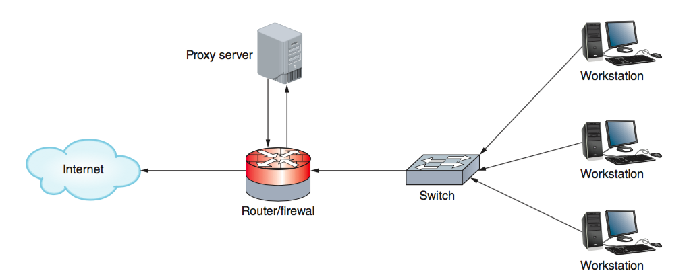

# CSCI 270 Spring 2022
# Chapter 10: Security in Network Design
## Objectives
+ Describe the functions and features of various network security devices
+ Implement security precautions on a switch
+ Track the processes of authentication, authorization, and auditing on a network
+ Explain the available options in network access control methods
+ Configure various security measures on a wireless network

## Network Security Devices
+ Devices designed specifically with network security
  - firewalls
  - IDS/IPS systems
+ Devices with non-security purposes, but still with significant security features and abilities
  - proxy servers
  - ACLs

### Proxy Servers

+ A proxy server, or proxy, acts as an intermediary between the external and internal networks, screening all incoming and outgoing traffic.
+ Proxy servers manage security at the Application layer of the OSI model. 

+ only provide low-grade security
+ they can help prevent an attack on internal network resources such as web servers and web clients.

+ **a proxy server represents a private network to another network (usually the Internet)**

<!--

-->

+ proxy servers can provide some content filtering
+ Proxy servers can also improve performance for users accessing resources external to their network by caching files.
  - for example : to save recently viewed web pages
+ the reverse proxy provides identity protection for the server rather than the client
### ACLs (Access Control Lists) on Network Devices

+ A router’s main function is to examine packets and determine where to direct them based on their Network layer addressing information.
+ Routers can also decline to forward certain packets depending on their content according to ACL (access control list).
+ An ACL acts like a filter to instruct the router to permit or deny traffic according to one or more of the following variables:
  - Network layer protocol (for example, IP or ICMP)
  - Transport layer protocol (for example, TCP or UDP)
  - Source IP address
  - Destination IP address (which can restrict or allow certain websites)
  - TCP or UDP port number

+ On most routers, each interface must be assigned a separate ACL
+ Different ACLs may be associated with inbound and outbound traffic
+ Each ACL is assigned a number or name
+ An access list is not automatically installed on a router. If you don’t configure an ACL, the router allows all traffic through.

[ACL Lab](../Labs/CH10-ACL.md)

### Firewalls
+ A firewall is a specialized device or software that selectively filters or blocks traffic between networks.

  - network-based firewalls: protect an entire private network
  - host-based firewalls: only protect the computer on which they are installed.
  
  
#### packet-filtering firewall: the simplest form of a firewall 
+ A network device or application that examines the header of every packet of data it receives on any of its interfaces (called inbound traffic)
+ The firewall refers to its ACL to determine whether that type of packet is authorized to continue to its destination.
+ nearly all routers can be configured to act as packet-filtering firewalls via ACLs.

+ Some common criteria by which a packet-filtering firewall might accept or deny traffic include the following:
  - Source and destination IP addresses
  - Source and destination ports (for example, ports that supply TCP/UDP connections, FTP, Telnet, ARP, ICMP, and so on)
  - Flags set in the TCP header (for example, SYN or ACK)
  - Transmissions that use the UDP or ICMP protocols
  - A packet’s status as the first packet in a new data stream or a subsequent packet
  - A packet’s status as inbound to or outbound from your private network
+ For greater security, you may consider the factors when making your decision as follows:
  - Does the firewall support encryption?
  - Does the firewall support user authentication?
  - Does the firewall allow you to manage it centrally and through a standard interface?
  - How easily can you establish rules for access to and from the firewall?
  - Does the firewall support filtering at the highest layers of the OSI model, not just at the Data Link and Transport layers? For example, content-filtering firewalls can block designated types of traffic based on application data contained within packets. A school might configure its firewall to prevent responses from a website with questionable content from reaching the client that requested the site.
  - Does the firewall provide internal logging and auditing capabilities, such as IDS or IPS? IDS and IPS are described later in this chapter.
  - Does the firewall protect the identity of your internal LAN’s addresses from the outside world?
  - Can the firewall monitor packets according to existing traffic streams? A stateful firewall is able to inspect each incoming packet to determine whether it belongs to a currently active connection (called a stateful inspection) and is, therefore, a legitimate packet. A stateless firewall manages each incoming packet as a stand-alone entity without regard to currently active connections. Stateless firewalls are faster than stateful firewalls, but are not as sophisticated.

#### UTM (Unified Threat Management)
+ security strategy that combines multiple layers of security appliances and technologies into a single safety net.
+ One disadvantage to this arrangement is that the “total” really is the sum of its parts. 
+ is regaining ground as a leading security strategy, especially for small- to medium-sized businesses.

#### NGFW (Next Generation Firewalls): Layer 7 firewalls
+ a packet-filtering firewall only examines the packet header, not the content.
+ can not distiguish between harmless and harmful users
+ innovative features
  - application aware
  - user aware
  - context aware
#### Troubleshooting Firewalls
+ The most common cause of firewall failure is firewall misconfiguration.

### IDS (Intrusion Detection System)
+ An IDS (intrusion detection system) is a stand-alone device, an application, or a built-in feature running on a workstation, server, switch, router, or firewall.
+ It monitors network traffic, generating alerts about suspicious activity.

+ IDS is generally installed to provide security monitoring inside the network.

+ IDS most commonly exists as an embedded feature in UTM solutions or NGFWs.

+ An IDS uses two primary methods for detecting threats on the network:
  - statistical anomaly detection: compares network traffic samples to a predetermined baseline 
  - signature-based detection: looks for identifiable patterns, or signatures, of code
  
#### HIDS (host-based intrusion detection system)

#### NIDS (network-based intrusion detection system)

#### One drawback to using an IDS is the number of false positives it can generate.

### IPS (Intrusion Prevention System)
+ an IPS (intrusion prevention system) stands in-line between the attacker and the targeted network or host, and can prevent traffic from reaching that network or host.
+ IPSes were originally designed as a more comprehensive traffic analysis and protection tool than firewalls. However, firewalls have evolved, and as a result, the differences between a firewall and an IPS have diminished.

#### NIPS (network-based intrusion prevention system) 
#### HIPS (host-based intrusion prevention system) 

+ Both an IDS and IPS can be placed inside a network or on the network perimeter.

### SIEM (Security Information and Event Management)

+ IDS, IPS, firewalls, and proxy servers all generate a great deal of data that is stored in logs and must be monitored and analyzed in order to be of particular use in real time.
+ SIEM (Security Information and Event Management) systems can be configured to evaluate all of this data, looking for significant events that require attention according to predefined rules.
+ When one of these rules is triggered, an alert is generated and logged by the system.
+ a notification is then sent to IT personnel via email, text, or some other method. 
+ The challenge is to find the right balance between sensitivity and workload. 
+ The SIEM’s effectiveness is partly determined by how much storage space is allocated for the generated data, and by the number of events it processes per second.
+ The network administrator can fine-tune a SIEM’s rules for the specific needs of a particular network by defining which events should trigger which responses.

## Switch Management

### Switch Path Management

+ Redundancy at critical junctures: Redundancy allows data the option of traveling through more than one switch toward its destination and makes your network less vulnerable to hardware malfunctions.

+ A potential problem: traffic loops
  - STP (Spanning Tree Protocol) prevents traffic loops by calculating paths that avoid potential loops and by artificially blocking the links that would complete a loop. 
  - STP can adapt to changes in the network.
+ STP information is transmitted between switches via BPDUs (Bridge Protocol Data Units). 
+ When installing switches on your network, you don’t need to enable or configure STP, It will come with the switch’s operating software and should function smoothly by default and without intervention. 

#### To protect the integrity of STP paths and the information transmitted by these BPDUs, some security precautions that must be configured on STP-enabled interfaces include the following:
+ `BPDU guard`: Blocks BPDUs on any port serving network hosts, such as workstations and servers, and thereby ensures these devices aren’t considered as possible paths. BPDU guards also enhance security by preventing a rogue switch or computer connected to one of these ports from hijacking the network’s STP paths.
+ `BPDU filter`: Disables STP on specific ports. For example, you might use a BPDU filter on the [demarc](https://en.wikipedia.org/wiki/Demarcation_point), where the ISP’s service connects with a business’s network, to prevent the ISP’s WAN topology from mixing with the corporate network’s topology for the purpose of plotting STP paths.
+ `root guard`: Prevents switches beyond the configured port from becoming the root bridge. For example, an ISP might configure a root guard on an interface facing a customer’s network to ensure that none of the customer’s switches becomes the ISP’s root bridge.
  - [root bridge](https://www.certificationkits.com/cisco-certification/ccna-articles/cisco-ccna-switching/cisco-ccna-spanning-tree-protocolroot-bridge-rootdesignatedblocked-ports/)

####  Newer versions of STP include the following:
+ RSTP (Rapid Spanning Tree Protocol)
+ SPB (Shortest Path Bridging)
+ proprietary versions of STP by manufacturers such as Cisco and Extreme Networks

#### SPB at layer 3
+ making them more compatible with various types of technologies such as the connection protocols used on storage networks.

### Switch Port Security
+ Unused switch, router, or server ports can be accessed and exploited by hackers if they are not disabled.
+ Unused physical and virtual ports on switches and other network devices should be disabled until needed
+ Acceptable MAC addresses are stored in a MAC address table.
+ Once the MAC address table is full, a security violation occurs if another device attempts to connect to the port.

## AAA(Authentication, Authorization, and Accounting)
+ Controlling users’ access to a network and its resources consists of three major elements:
  - authentication
    + is the process of verifying a user’s credentials (typically a username and password) to grant the user access to secured resources on a system or network.
    + “Who are you?”
  - authorization
    + determines what the user can and cannot do with network resources.
    + “What are you allowed to do?”
  - accounting.
    + logs users’ access and activities on the network.
    +  “What did you do?”

### Authentication
#### Local Authentication
+ Usernames and passwords are stored locally
  - low security
    + Most end user devices are less secure than network servers. A hacker can attempt a brute force attack or other workarounds to access a single device. If those same credentials are used on other devices, then all these devices are compromised. Also, local authentication does not allow for remotely locking down a user account.
  - convenience varies
    + For only a handful of devices, managing local accounts can be done a lot more easily than setting up a Windows domain, directory services, and all the supporting configurations. However, once you surpass about a dozen devices, the convenience of local authentication declines considerably.
  - reliable backup access
    + In the case of a network failure or server failure, the only workable option is local authentication. For this reason, networking devices and servers should be configured with a local privileged account that is only used when authentication services on the network are unavailable, and of course this account should have very secure credentials.
+ With local authentication, every computer (workstation or server) on the network is responsible for securing its own resources

#### Network Authentication and Logon Restrictions
+ You can harden your network by requiring secure passwords to authenticate to the network.
  - time of day
  - total time logged on
  - source address
  - unsuccessful logon attempts
  - geographic location
    + With geofencing, GPS (global positioning system) or RFID (radio frequency identification) data is sent to the authentication server to report the location of the device attempting to authenticate to the network.
    
### Authorization
+ User access to network resources falls into one of these two categories:
  - the privilege or right to execute, install, and uninstall software
  - permission to read, modify, create, or delete data files and folders. 
  
  
+ The most popular authorization method is **RBAC** (role-based access control).
  - a network administrator creates user groups associated with these roles and assigns privileges and permissions to each user group.
  - Each user is assigned to a user group that matches a requirement for his job, and in most cases, a user can belong to more than one user group.
  - In some situations,role separation is implemented. (If a user is listed in more than one group, all privileges and permissions are locked down for that user.)
  
  
### Accounting
+ With a Linux or Macintosh NOS, most logs are generated as text files. 
+ You can install a log file viewer to make it easier to monitor log files for interesting or suspicious events.

### NAC (Network Access Control) Solutions

To balance network access with network security, a NAC (network access control) system takes authentication, authorization, and accounting to a new level.

+ A NAC system employs a set of rules, called network policies, which determine the level and type of access granted to a device when it joins a network.
  - NAC systems authenticate and authorize devices by verifying that the device complies with predefined security benchmarks.
    + such as whether the device has certain system settings, or whether it has specific applications installed.
    + agent: software that must be installed on the device before the device can be authenticated.
      - nonpersistent agent
        + remains on the device long enough to verify compliance and complete authentication, and then uninstalls.
        + Devices might be required to periodically reinstall the agent to complete the
authentication process again.
      - persistent agent
        + permanently installed on a device. This more robust
program might provide additional security measures, such as remote wipe, virus scans, and mass messaging.
    + agentless authentication
      - in which the user is authenticated to a domain. Active Directory then scans the device to determine compliance with NAC requirements.
+ Not every device that connects to a NAC-protected network must be preconfigured as an approved device.
  - Guest devices can be granted limited access to network resources in a guest network or public network, which provides a layer of protection from the private network’s resources.
  - devices that do not meet compliance requirements, or that are indicated to have been compromised, can be placed in a quarantine network, which is separate from sensitive network resources and might limit the amount of time the device can remain connected to the network, until remediation steps can be completed.

## Access Control Technologies

### Directory Services
+ in order for clients to authenticate to network resources
+ maintain a database of account information
  - usernames
  - passwords
  - other authentication credentials

+ accomplished in LDAP-compliant servers
  - AD (Active Directory) servers
  - or more Linux- focused like OpenLDAP (openldap.org) servers
  - or 389 Directory Server (directory.fedoraproject.org)

#### LDAP (Lightweight Directory Access Protocol) 
+ LDAP is a standard protocol for accessing an existing directory. 
+ The mechanisms of LDAP dictate some basic requirements for any directory it accesses.
+ there is a lot of commonality in how directory servers are configured, regardless of the software used.
+ LDAP can query the database, which draws information out of the database. It can also be used to add new information or edit existing data.

### AD
+ AD is configured to use the Kerberos protocol(by default) or LDAP or both.
+ Kerberos provides authentication with the database,
+ LDAP provides authorization by determining what the user can do while they’re on the network.

### Kerberos
+ Kerberos is the authentication protocol configured by default on Active Directory.
+ Kerberos is a cross-platform authentication protocol.
+ Kerberos uses key encryption to verify the identity of clients and to securely exchange information after a client logs on to a system.

#### terms for Kerberos protocol
+ **principal**—A Kerberos client or user.
+ **KDC (Key Distribution Center)**—The server that issues keys to clients during
initial client authentication.
+ **ticket**—A temporary set of credentials that a client uses to prove to other servers
that its identity has been validated.

#### A Kerberos server runs two services:
+ AS (authentication service)—Initially validates a client.
+ TGS (ticket-granting service)—Issues tickets to an authenticated client for access to services on the network.

### SSO (Single Sign-On)
+ a client signs on one time to access multiple systems or resources
+ advantage
  - convenience: Users don’t have to remember several passwords, and network administrators can limit the time they devote to password management.
+ disadvantage:
  - once the obstacle of authentication is cleared, the user has access to numerous resources.
#### 2FA (two-factor authentication)
+ a user must provide something and know something.
#### MFA (multifactor authentication)
+ something you know—A password, PIN, or biographical data
+ something you have—An ATM card, smart card, or key
+ something you are—Your fingerprint, facial pattern, or iris pattern
+ somewhere you are—Your location in a specific building or secured closet
+ something you do—The specific way you type, speak, or walk

### RADIUS (Remote Authentication Dial-In User Service)
+ In environments that support many simultaneous connections and several user IDs and passwords, it might make sense to use a centralized service to manage access to resources across all three functions of AAA.
+ the most popular AAA service is RADIUS (Remote Authentication Dial-In User Service).
+ It runs in the Application layer and can use either UDP or, as of 2012, TCP in the Transport layer.
+ RADIUS treats authentication and authorization as a single process, while accounting is a separate process.

### TACACS1 (Terminal Access Controller Access Control System Plus)
+ offers network administrators the option of separating the authentication, authorization, and auditing capabilities
+ TACACS1 differs from RADIUS in that it:
  - Relies on TCP, not UDP, at the Transport layer.
  - Was developed by Cisco Systems, Inc., for proprietary use.
  - Is typically installed on a router or switch, rather than on a server.
  - Is most often used for device administration access control for technicians, although it can be used for network resource access control for users.
  - Encrypts all information transmitted for AAA (RADIUS only encrypts the password).

## Wireless Network Security
+ Wireless networks have some of the inherent weaknesses of WEP (Wired Equivalent Privacy)
  - it used a shared encryption key for all clients and the key might never change. 
+ WEP offered two forms of authentication, neither of which is secure:  
  - OSA (Open System Authentication)
  - SKA (Shared Key Authentication)
+ security improvements made through 
  - **WPA** (Wi-Fi Protected Access)
  - and its successor, **WPA2**.
  
### WPA (Wi-Fi Protected Access)
+ TKIP (Temporal Key Integrity Protocol)
  - an encryption key generation and management scheme
  - incorporated by 802.11i 
  - three significant improvements
    + **message integrity**: Uses a message integrity code, called Michael, that ensures incoming packets are, in fact, coming from their declared source. This is also called packet authentication.
    + **key distribution**: Assigns every transmission its own key.
    + encryption
   
+ TKIP was meant to be backward-compatible as much as possible.

### WPA2 (Wi-Fi Protected Access, Version 2)
+ **CCMP**: 
  - Counter Mode with CBC (Cipher Block Chaining) MAC (Message Authentication Code) Protocol
  - stronger technologies for data confidentiality
  - helps ensure data confidentiality with both encryption and packet authentication by providing:
    + message integrity
    + encryption: CCMP also uses AES (Advanced Encryption Standard), which provides faster and more secure encryption than TKIP for wireless transmissions.
+ CCMP is more future-focused.

### Personal and Enterprise
#### Personal 
+  WPA-PSK and WPA2-PSK
  - PSK is short for Pre-Shared Key.
#### Enterprise
+ The Enterprise versions of WPA and WPA2 implement additional security measures such as 
  - EAP(Extensible Authentication Protocol)
    + EAP can function alongside RADIUS, where EAP organizes communications with the network client device and RADIUS handles the actual authentication on the server. 
  - PEAP (Protected EAP)
  - EAP-FAST (EAP-Flexible Authentication via Secure Tunneling)
  

