# CSCI 270 Spring 2022

# Chapter 4 Network Protocols and Routing
## Objectvies
+ Describe the functions of core TCP/IP protocols
+ Identify how each protocol’s information is formatted in a TCP/IP message
+ Explain how routers manage internetwork communications
+ Employ various TCP/IP utilities for network discovery and troubleshooting

## TCP/IP core protocols

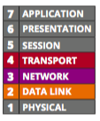

+ TCP/IP is a suit of protocols.
+ Including TCP, IP, UDP, ARP...

+ 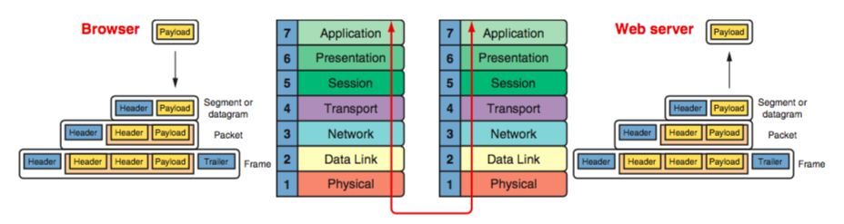
  - sending host layer 7,6,5: original data generated by some application to create a **payload**
  - sending host layer 4: TCP/UDP adds a header to the payload to create a **segment/datagram**
  - sending host layer 3: IP adds a header to the segment/datagram to create a **packet**
  - sending host layer 2: NIC adds a header and a trailer to the packet to create a **frame**
  - sending host layer 1: places the actual trasmission on the network
  - receiving host: de-encapsulates the message
  

+ Connectivity devices are known by the highest OSI layer they read and process
  - switch: layer 2 (note: there exist layer 3 switches)
  - router: layer 3
  - firewall: layer4
  
  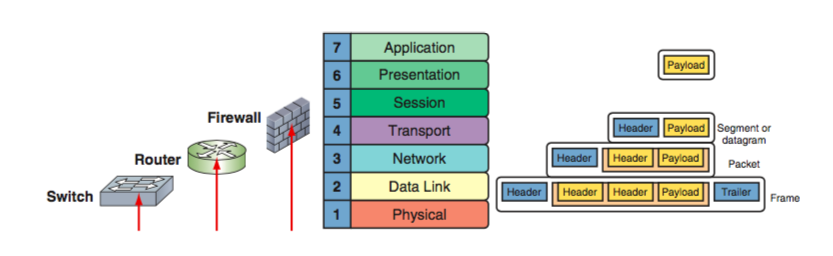
  
### TCP(transmission control protocol): a reliable delivery protocol

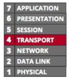

+ connection-oriented 
  - Before TCP transmits data, it ensures that a connection or session is established by a **three-way handshake**.
+ sequencing and checksums:
  - checksum:  Compare two checksum strings generated by sending and receiving host, if they fail to match, re-send the data
  - sequencing: sequencing numbers to reorder segments as they may not arrive in the order they are created.
+ flow control: the process of gauging the appropriate rate of transmission based on how quickly the recipient can accept data
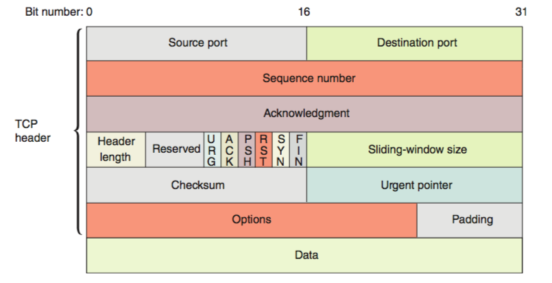

#### TCP Three-Way Handshake
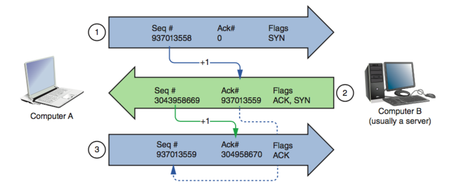
+ Step 1: SYN (Computer A: **I want to establish a connection.**)
  - seq#: random
  - ack#: 0
  - flags: SYN
+ Step 2: SYN/ACK (Computer B: **I agree.**)
  - seq#: random
  - ack#: seq#(in step 1) + 1
  - flags: SYN/ACK
+ step 3: ACK (Computer A: **The connection is established.**)
  - seq#: ack#in step 2)
  - ack#: seq#(in step 2) + 1
  - flag: ACK
+ **note that**:
  - no payload has beed included.
  - the random seq# is not real random.
  - the increment of seq# is 1 in the three-way handshake, the increment will be the length of the message after the connection is established.
  - max packet size 64k(65535 bytes), MTU (Maximum Transmission Unit) for Ethernet 1500 bytes. Find details in section **Ethernet** on textbook. 
#### TCP Four Waves

#### [TCP Lab](../Labs/CH4-TCP.md)

### UDP(user datagram protocol): a unreliable, connectionless protocol

+ **unreliable**: UPD does not guarantee dilievery of data.
+ **connectionless**: no three-way handshake to establish a connection
+ no acknoledgment of transmission
+ no error checking
+ no sequencing
+ no flow control
+ **more efficient**

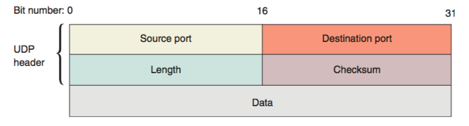

+ Example: DNS

### IP (internet protocol)

A layer 3 protocal that
+ identifies the data's source and destination IP addresses.
+ enable TCP/IP to internetwork - to traverse among LANs through routers
+ is a connectionless protocol - no session to be established

+ IPv4 packet

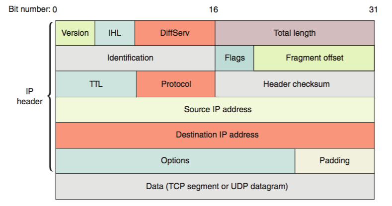

+ IPv6 packet

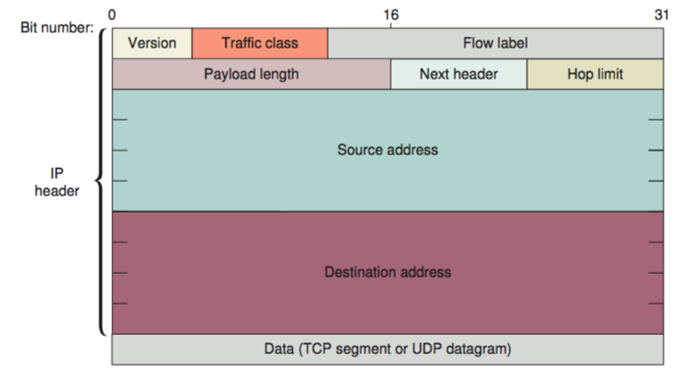

### ICMP (internet message control protocol)

+ a core layer 3 protocol that reports on the sucess or failure of data delievery to the sender, including
  - when part of the network is congested.
  - when data fails to reach its destination.
  - when data has been discarded.
  
+ note that: ICMP does not fix the failure, higher protocols such as TCP is responsible for that.

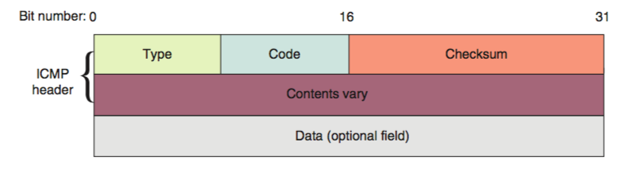

### ARP(address resolution protocol) on IPv4 networks

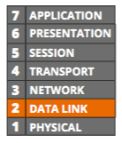

+ discovers MAC address on LAN
+ maintains the ARP table (relation between MAC and IP addresses)
+ sometimes is called layer 2.5 protocol, because it touches IP in layer 3 and MAC in layer 2.
+ ARP can be static (entered manually) or dynamic (created by an ARP request) 
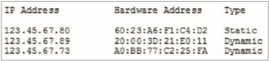

### ARP Command: arp -a

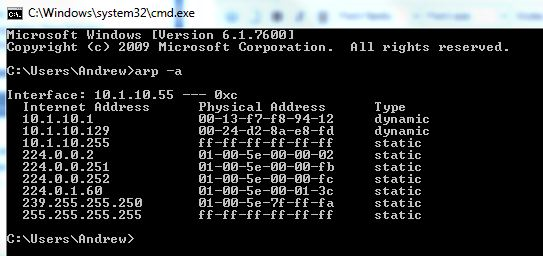

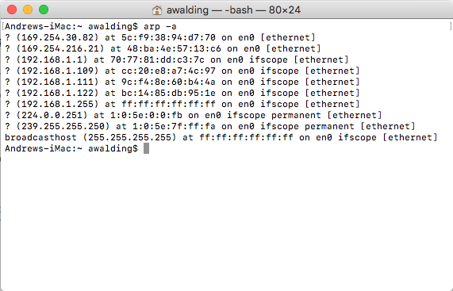

#### [ARP Lab](../Labs/CH4-ARP.md)

### Ethernet

+ the most popular network technology on LANs.
+ Ethernet II is the current Ethernent standard.
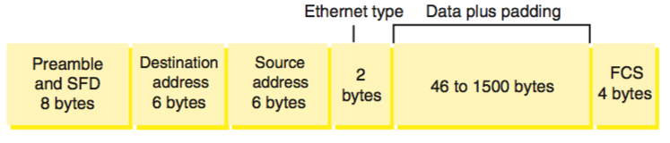

+ MTU(maximum transmission units): the maximum payload size that a layer 2 frame can encapsulate.

## Summary
|Layer|the most important added info|
|----|----|
|4|source port and destination port|
|3|source IP and destination IP|
|2.5|IP to MAC|
|2|source MAC and destination MAC|

## Broadcast Domain vs. Collision Domain
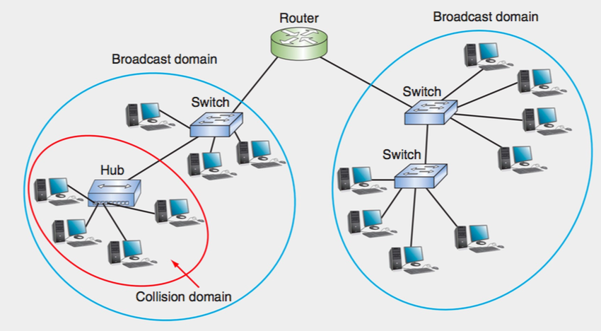
### Collision domain
+ When the transmissions of two nodes interfere with each other, a **collision** happens. After a collision, each node waits a random amount of time and then resends the transmission.
+ A **collision domain** is the portion of a network in which collisions can occur.
+ Hubs connecting multiple computers in a star-bus topology resulted in massive collisions.
### Broadcast domain
+ A **broadcast domain** is a logical division of a computer network, in which all nodes can reach each other by broadcast at the data link layer.
+ A broadcast domain can be within the same LAN segment or it can be bridged to other LAN segments.

## Routers
+ A router joins two or more networks and passes packets from one network to another.
+ Routers are responsible for determining the next network to which a packet should be forwarded on its way to its destination.
+ A typical router has an internal processor, an operating system, memory, input and output jacks for different types of network connectors (depending on the network type), and, usually, a management console interface. 
### Router functions
+ all routers can do the following:
  - Connect dissimilar networks, such as a LAN and a WAN, which use different types of routing protocols.
  - Interpret Layer 3 and often Layer 4 addressing and other information (such as quality of service indicators).
  - Determine the best path for data to follow from point A to point B. The best path is the most efficient route to the message’s destination calculated by the router, based upon the information the router has available to it.
  - Reroute traffic if the path of first choice is down but another path is available.
+ optional functions:
  - Filter broadcast transmissions to alleviate network congestion.
  - Acting as a simple firewall, prevent certain types of traffic from getting to a network, enabling customized segregation and security.
  - Support simultaneous local and remote connectivity.
  - Provide high network fault tolerance through redundant components such as
power supplies or network interfaces.
  - Monitor network traffic and report statistics.
  - Diagnose internal or other connectivity problems and trigger alarms.
  
### Router classification
+ Core, edge, and exterior routers
+ **AS (autonomous system)** is a group of networks, often on the same domain, that are operated by the same organization.
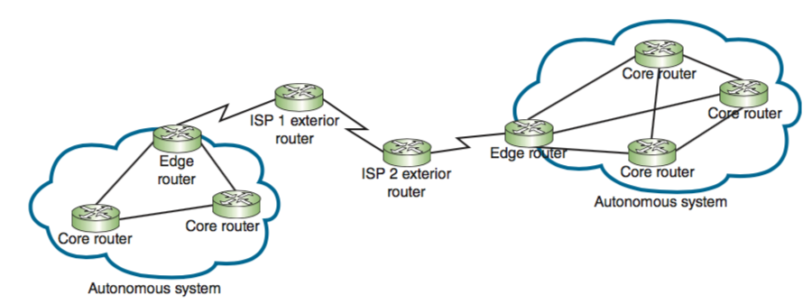

### Multilayer Switches
#### Layer 3 switch 
+ A Layer 3 switch is a switch that is capable of interpreting Layer 3 data and works much like a router. 
+  Layer 3 switches were designed to work on large LANs, similar to core routers, except they’re faster and less expensive.
+ The primary difference is the way the hardware is built, but, in fact, it’s often difficult to distinguish between a Layer 3 switch and a router. 

#### Layer 4 switch
+ Layer 4 switches also exist and are capable of interpreting Layer 4 data. 
+ They operate anywhere between Layer 4 and Layer 7 and are also known as content switches or application switches. 

####
+ They are typically used as part of a network’s backbone and are not appropriate on a single LAN. 
+ In general, however, Layer 4, Layer 3, and Layer 2 switches are all optimized for fast Layer 2 data handling.
+ Keep in mind that Layer 3 and Layer 4 switches can work the same way.

### Routing Tables
+ A routing table is a database that holds information about where hosts are located and the most efficient way to reach them.
+ A router relies on its routing table to identify which network a host belongs to and which of the router’s interfaces points toward the best next hop to reach that network.

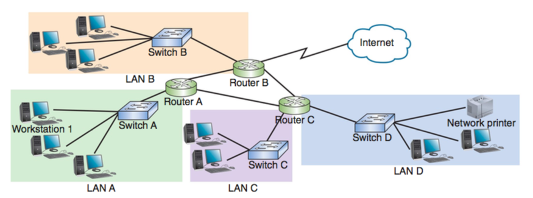

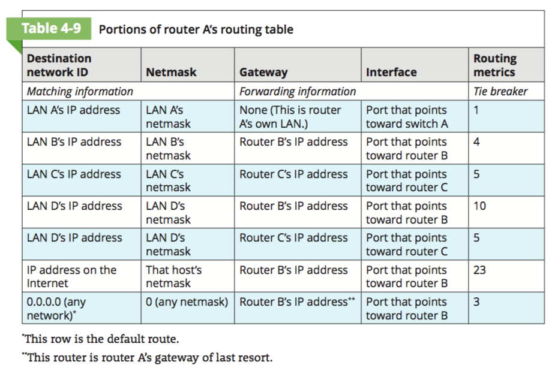

### Routing Path Types
+ **static routing**—A network administrator configures a routing table to direct mes- sages along specific paths between networks.
+ **dynamic routing**—A router automatically calculates the best path between two networks and accumulates this information in its routing table.

### Routing Metrics
Some examples of routing metrics used to determine the best path may include:
+ Hop count, which is the number of network segments crossed
+ Theoretical bandwidth and actual throughput on a potential path
+ Delay, or latency, on a potential path, which results in slower performance
+ Load, which is the traffic or processing burden sustained by a router in the path
+ MTU, which is the largest IP packet size in bytes allowed by routers in the path
without fragmentation (excludes the frame size on the local network)
+ Routing cost, which is a value assigned to a particular route as judged by the network administrator; the more desirable the path, the lower its cost
+ Reliability of a potential path, based on historical performance  
+ A network’s topology

### Routing Protocols to Determine Best Paths
+ There are routing protocols on layers 3, 4 and 7, we focus on layer 3.
+ **AD (administrative distance)**—Each routing protocol is assigned a default AD, which is a number indicating the protocol’s reliability, with lower values being given higher priority. 
+ **convergence time**—Routing protocols are also rated on the time it takes to recognize a best path in the event of a change or network outage.
+ overhead—A routing protocol is rated on its overhead, or the burden placed on the underlying network to support the protocol.
#### Common routing protocols
|routing protocol|Type|Algorithm used|
|----|----|----|
|RIP (Routing Information Protocol)|IGP |Distance-vector|
|RIPv2 (Routing Information Protocol, version 2)|IGP|Distance-vector|
|OSPF (Open Shortest Path First)|IGP|Link-state|
|IS-IS (Intermediate System to Intermediate System)|IGP|Link-state|
|EIGRP (Enhanced Interior Gateway Routing Protocol)|IGP|Advanced distance-vector|
|BGP (Border Gateway Protocol)*|EGP|Advanced distance-vector or path vector|

#### Interior and Exterior Gateway Protocols
+  IGPs (interior gateway protocols)
  - used by core routers and edge routers within autonomous systems.
  - IGPs are often grouped according to the algorithms they use to calculate best paths.
    + **Distance-vector routing protocols** calculate the best path to a destination
on the basis of the distance to that destination.
    + **Link-state routing protocols** enable routers to communicate beyond neighboring routers, after which each router can independently map
the network and determine the best path between itself and a message’s destination node.

+ EGPs (exterior gateway protocols) 
  - used by edge routers and exterior routers to distribute data outside of autonomous systems.

#### Legacy routing protocols
+ RIP(Routing Information Protocol) and RIP2
+ less than 15 hops
+ metric: Hop count
+ exchange of routing information: UDP with port 520
+ routing-update messages are sent 
  - at regular intervals(30s) and 
  - when the network topology changes.
  
+ example:
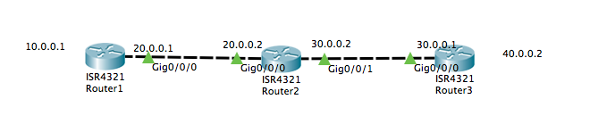

  - step 1: the routing tables of all routers only contain directly-connected information(the table does not contain mask for simplicity)
    + R1
    
  |Network|Next Hop|Hop count|
  |----|----|----|
  |10.0.0.0|`--`|0|
  |20.0.0.0|`--`|0|
  
    + R2
    
  |Network|Next Hop|Hop count|
  |----|----|----|
  |20.0.0.0|`--`|0|
  |30.0.0.0|`--`|0|
  
    + R3
    
  |Network|Next Hop|Hop count|
  |----|----|----|
  |30.0.0.0|`--`|0|
  |40.0.0.0|`--`|0|
  
 - step 2: suppose routing update happens in R2 first(it depends on the order that the routers are turned on), R2 receives the routing update from R1 and R3 and updates its routing table.
  + the routing information R1 sends to R2 is
  
  |Network|Next Hop|Hop count|
  |----|----|----|
  |10.0.0.0|20.0.0.1|1|
  |20.0.0.0|20.0.0.1|1|
  
  + the routing information R3 sends to R2 is
  
  |Network|Next Hop|Hop count|
  |----|----|----|
  |30.0.0.0|30.0.0.1|1|
  |40.0.0.0|30.0.0.1|1|
  
  + combine three tables(inital R2, R1->R2, R3->R2)
  
  |Network|Next Hop|Hop count|
  |----|----|----|
  |20.0.0.0|`--`|0|
  |30.0.0.0|`--`|0|
  |10.0.0.0|20.0.0.1|1|
  |20.0.0.0|20.0.0.1|1|
  |30.0.0.0|30.0.0.1|1|
  |40.0.0.0|30.0.0.1|1|
  
  + for duplicate networks, only keep the one with the least hop count
  
  |Network|Next Hop|Hop count|
  |----|----|----|
  |20.0.0.0|`--`|0|
  |30.0.0.0|`--`|0|
  |10.0.0.0|20.0.0.1|1|
  |40.0.0.0|30.0.0.1|1|
  
 - step 3: R2 will send its whole routing table to R1 and R3, let's deal with R1 first.
  
  |Network|Next Hop|Hop count|
  |----|----|----|
  |20.0.0.0|20.0.0.2|1|
  |30.0.0.0|20.0.0.2|1|
  |10.0.0.0|20.0.0.2|2|
  |40.0.0.0|20.0.0.2|2|
  
  **Note**: the next hop is 20.0.0.2 because R2 send its routing table to R1 through port 20.0.0.2. the hop counts increase by 1 because for each destination network, R1 can use R2 as the next hop.
  
- step 4: R1 will compare the routing table in step 3 with its original one to keep entries with new destination networks or least hop count.

  |Network|Next Hop|Hop count|
  |----|----|----|
  |10.0.0.0|`--`|0|
  |20.0.0.0|`--`|0|
  |30.0.0.0|20.0.0.2|1|
  |40.0.0.0|20.0.0.2|2|
  
- step 5: repeat steps 3 and 4 for R3 to get the routing table for R3.

  |Network|Next Hop|Hop count|
  |----|----|----|
  |30.0.0.0|`--`|0|
  |40.0.0.0|`--`|0|
  |10.0.0.0|30.0.0.2|2|
  |20.0.0.0|30.0.0.2|1|
  
#### OSPF (Open Shortest Path First)
+ core or edge routers
+ only IPv4
+ supports large networks(no hop limits )
+ complex algorithms(Calculates more efficient best paths)
+ shared data(Maintains a database of the other routers’ links.)
+ low overhead, fast convergence(keeps network bandwidth to a minimum with a very fast convergence time)
+ stability(prevent routing loops)
+ multi-vendor routers(Supported by all modern routers)
#### IS-IS (Intermediate System to Intermediate System)
+ core routers only
+ both IPv4 and IPv6.
#### EIGRP (Enhanced Interior Gateway Routing Protocol)
+ a fast convergence time and low network overhead
+ easier to configure and less CPU-intensive than OSPF
+ support multiple protocols 
+ limit unnecessary network traffic between routers
+ accommodates very large and heterogeneous networks
+ optimized for Cisco routers 
+ On LANs that use Cisco routers exclusively, EIGRP is generally preferred over OSPF.
#### BGP (Border Gateway Protocol)
+ edge and exterior routers
+ special characteristics of BGP
  - **path-vector routing protocol**: Communicates via BGP-specific messages that travel between routers over TCP sessions.
  - **efficient**: Determines best paths based on many different factors.
  - **customizable**: Can be configured to follow policies that might, for example,
avoid a certain router, or instruct a group of routers to prefer one particular route over other available routes.

# Troubleshooting Tools
## netstat
+ the port on which a TCP/IP service is running
+ which network connections are currently established for a client
+ how many messages have been handled by a network interface since it was activated
+ how many data errors have occurred on a particular network interface

|netstat command for Windows|Description|
|----|----|
|netstat|Lists all active TCP/IP connections on the local machine, including the Transport layer protocol used (usually just TCP), messages sent and received, IP address, and state of those connections.|
|netstat -n|Lists current connections, including IP addresses and ports.|
|netstat -f|Lists current connections, including IP addresses, ports, and FQDNs.|
|netstat -a|Lists all current TCP connections and all listening TCP and UDP ports.|
|netstat –e|Displays statistics about messages sent over a network interface, includ- ing errors and discards.|
|netstat –s|Displays statistics about each message transmitted by a host, separated according to protocol type (TCP, UDP, IP, or ICMP).|
|netstat –r|Displays routing table information.|
|netstat –o|Lists the PID (process identifier) for each process using a connection and information about the connection.|
|netstat –b|Lists the name of each process using a connection and information about the connection. Requires an elevated Command Prompt.|

## tracert(windows) or traceroute(unix,linux)
+ The Windows **tracert** utility uses ICMP echo requests to trace the path from one networked node to another, identifying all intermediate hops between the two nodes.
+ Linux, UNIX, and macOS systems use UDP datagrams or, possibly, TCP SYN messages, for their **traceroute** utility, but the concept is still the same.
+ Both traceroute and tracert utilities employ a trial-and-error approach to discover the nodes at each hop from the source to the destination, as described here:
  - Traceroute sends UDP messages to a random, unused port on the destination node, and listens for an ICMP “Port Unreachable” error message in response from that node.
  -  Tracert sends an ICMP echo request to the destination node and listens for an ICMP echo reply from that node.
  -  Both utilities limit the TTL of these repeated trial messages, called **probes**, thereby triggering routers along the route to return specific information about the route being traversed. In fact, by default they send three probes with each iteration so averages can be calculated from the three responses at each step.

|Command|Description|
|---|---|
|traceroute –n google.com or tracert –d google.com|Instructs the command to not resolve IP addresses to host names.|
|traceroute –m 12 google.com or tracert –h 12 google.com|Specifies the maximum number of hops when attempting to reach a host; this parameter must be followed by a specific number. Without this parameter, the command defaults to 30.|
|traceroute –w 2 google.com or tracert –w 2000 google.com|Identifies a timeout period for responses; this parameter must be followed by a variable to indicate the number of seconds (in Linux) or milliseconds (in Windows) that the utility should wait for a response. The default time is usually between 3 and 5 sec- onds for Linux and 4000 milliseconds (4 seconds) for Windows.|
|traceroute –f 3 google.com|ets the first TTL value and must be followed by a variable to indicate the number of hops for the first probe. The default value is 1, which begins the trace at the first router on the route. Beginning at later hops in the route can more quickly narrow down the location of a network problem. tracert does not have a corresponding parameter for this function.|
|traceroute –I google.com|Instructs the command to use ICMP echo requests instead of UDP datagrams.|
|traceroute –T google.com|Instructs the command to use TCP SYN probes instead of UDP datagrams.|
|traceroute –4 google.com or tracert –4 google.com|Forces the command to use IPv4 packets only.|
|traceroute –6 google.com or tracert –6 google.com|Forces the command to use IPv6 packets instead of IPv4. The other parameters can be added to these IPv6 commands and function essentially the same as they do in IPv4.|

## pathping(windows)
+ The Windows utility pathping combines elements of both ping and tracert to provide deeper information about network issues along a route.

|pathping command|Description|
|---|---|
|pathping –ngoogle.com|Instructs the command to not resolve IP addresses to host names.|
|pathping –h 12google.com|Specifies the maximum number of hops the messages should take when attempting to reach a host (the default is 30); this parameter must be followed by a specific number of hops.|
|pathping –p 2000google.com|Identifies the wait time between pings; this parameter must be followed by a variable to indicate the number of milliseconds to wait. The default time is 4000 milliseconds (4 seconds).|
|pathping –q 4google.com|Limits the number of queries per hop; must be followed by a variable to indicate the number of queries allowed. By default, pathping sends 100 pings per hop, which tends to take a long time to run.|

## mtr or mtr-tiny (linux)
+ similar to pathping(windows)

## tcpdump (linux, unix)
+ The tcpdump utility is a free, command-line **packet sniffer** that runs on Linux and other Unix operating systems.
+ A packet sniffer works as the Wireshark software.
+ You must either use the sudo command or log in as root to access tcpdump. To do this, either enter sudo before each tcpdump command, or at the shell prompt, enter sudo su root, which changes you over to the root account.

|tcpdump command|Description|
|---|---|
|tcpdump not port 22 or tcpdump not port 23|Filters out SSH or Telnet packets, which is helpful when running tcpdump on a remotely accessed network device.|
|tcpdump -n|Instructs the command to not resolve IP addresses to host names.|
|tcpdump -c 50|Limits the number of captured packets to 50.|
|tcpdump -i any|Listens to all network interfaces on a device.|
|tcpdump -D|Lists all interfaces available for capture.|
|tcpdump port http|Filters out all traffic except HTTP.|
|tcpdump -w capture.cap|Saves the file output to a file named capture.cap.|
|tcpdump -r capture.cap|Reads the file capture.cap and outputs the data in the terminal win- dow. This file can also be read by applications like Wireshark.|

# Solving Common Routing Problems

|Command|Common uses|
|---|---|
|arp|Provides a way of obtaining information from and manipulating a device’s ARP table.|
|dig|Queries DNS servers with more advanced options than nslookup.|
|ipconfig or ifconfig|Provides information about TCP/IP network connections and the ability to manage some of those settings.|
|netstat|Displays TCP/IP statistics and details about TCP/IP components and connections on a host.|
|nmap|Detects, identifies, and monitors devices on a network.|
|nslookup|Queries DNS servers and provides the ability to manage the settings for accessing those servers.|
|pathping (mtr on Linux/UNIX/ macOS)|Sends multiple pings to each hop along a route, then compiles the information into a single report.|
|ping|Verifies connectivity between two nodes on a network.|
|route|Displays a host’s routing table.|
|tcpdump|Captures traffic that crosses a computer’s network interface.|
|traceroute or tracert|Traces the path from one networked node to another, identifying all intermediate routers between the two nodes.|

## Duplicate MAC Addresses
## Hardware Failure
## Discovering Neighbor Devices
