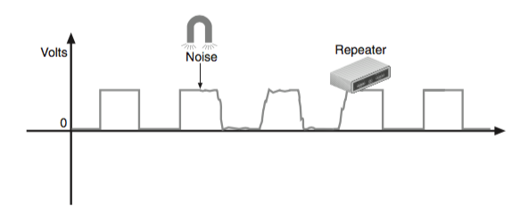

# Chapter 5 Network Cabling
## objectives
+ Explain basic data transmission concepts, including throughput, bandwidth, multiplexing, and common transmission flaws
+ Identify and describe the physical characteristics and official standards of coaxial cable, twisted-pair cable, and fiber-optic cable, and their related connectors
+ Compare the benefits and limitations of various networking media

# Transmission Basics

+ The goal of the transmission techniques is to maximize the efficiency of the networks.
## network efficiency: A networking professional often needs to measure two transmission characteristics
+ **bandwidth**: The amount of data that could theoretically be transmitted during a given period of time. 
+ **throughput**/payload rate/effective data rate: The measure of how much data is actually transmitted during a given period of time.

+ In networking, throughput and bandwidth are commonly expressed as bits transmitted per second, called bit rate.

+ The actual throughput is usually lower than the bandwidth.

# Transmission Flaws
why throughput < bandwidth?
+ noise
  - Noise can degrade or distort a signal and, on a network, is measured in dB (decibels).
  - Two common sources of noise
    + EMI (electromagnetic interference): caused by electrical activity, such as RFI (radio frequency interference).
    + crosstalk: Occurs when a signal traveling on one wire or cable infringes on the signal traveling over an adjacent wire or cable
    
    + 
     
      - alien crosstalk: Crosstalk that occurs between two cables
      - NEXT (near end crosstalk): Crosstalk that occurs between wire pairs near the source of a signal
      - FEXT (far end crosstalk): Crosstalk measured at the far end of the cable from the signal source
      
  - <b>In every signal, a certain amount of noise is unavoidable.</b>
  
+ attenuation
  - the loss of a signal’s strength as it travels away from its source.
  
  
  
  
  - solution: **repeater** which regenerates a digital signal in its original form without the noise it might have previously accumulated
  
  
  
  
+ latency.
  - latency is the delay between the instant when data leaves the source and when it arrives at its destination.
  - caused by the length of the cable, any intervening connectivity devices(such as routers)
  - measured by packet's RTT(round trip time)
  - problems caused by latency
    + **jitter/PDV (packet delay variation)**: If packets experience varying amounts of delay, they can arrive out of order
    + If the node does not receive the rest of the data stream within a given time period, and therefore assumes no more data is coming.
  
# methods of communication
While noise, attenuation, and latency degrade a network’s efficiency, there are some changes you can make to the network to increase efficiency. First, let’s consider settings on a device’s NIC.
 
+ the direction in which signals travel over the media 
+ the number of signals that can traverse the media at any given time.
 
These two settings are combined to create different methods of communication:
+ full-duplex, also called duplex—Signals are free to travel in both directions over a medium simultaneously. 
  - duplex can be achived by pairing two wires together inside the cable or transmitting two or more signals on the same wire(Multiplexing).
  
+ half-duplex-Signals may travel in both directions over a medium but in only one direction at a time.
+ simplex—Signals may travel in only one direction.
 
 ## Multiplexing
 
 
 
 To carry multiple signals, the medium’s channel is logically separated into multiple smaller channels, or subchannels.
 - For each type of multiplexing, a device that can combine many signals on a channel, a multiplexer (mux), is required at the transmitting end of the channel. At the receiving end, a demultiplexer (demux) separates the combined signals.

 - common types of multiplexing used on copper lines 
    + TDM (time division multiplexing)—Divides a channel into multiple intervals of time, or time slots. 
    + STDM (statistical time division multiplexing)—Assigns time slots to nodes (similar to TDM), but then adjusts these slots according to priority and need.
    + FDM (frequency division multiplexing)—Assigns different frequencies to create multiple frequency bands, each used by a subchannel, so that multiple signals can transmit on the line at the same time.
 - common types of multiplexing used on fiber-optic cable 
    + WDM (wavelength division multiplexing)—Works with any fiber-optic cable
to carry multiple light signals simultaneously by dividing a light beam into different wavelengths, or colors, on a single fiber.
    + DWDM (dense wavelength division multiplexing or dense WDM)—Increases the number of channels provided by normal WDM to between 80 and 320 channels.
    + CWDM (coarse wavelength division multiplexing or coarse WDM)—Lowers cost by spacing frequency bands wider apart to allow for cheaper transceiver equipment.

[FMD VS. TDM VS. WDM](https://www.differencebetween.com/difference-between-fdm-tdm-and-wdm/)
# different types of transmission media

## coaxial cable (legacy media)
+ the foundation for Ethernet networks in the 1980s.

+ 

+ two most common coax specifiations still in use today

|Type|Impedance|Core|Use|
|----|----|----|----|
|RG-59|75 ohms|20 or 22 AWG core, usually made of braided copper |Still used for relatively short connections, for example, when distributing video signals from a central receiver to multiple monitors within a building. RG-59 is less expensive than the more common RG-6, but suffers from greater attenuation.|
|RG-6|75 ohms|18 AWG conducting core, usually made of solid copper|Used to deliver broadband cable Internet service and cable TV, particularly over long distances. Cable Internet service entering your home is RG-6.|

+ two connectors
  - F-conector
  
  
  
  - BNC conector
  
  
  
## Twisted-Pair Cable
+ four wire pairs of insulated copper wires
+ each with a diameter of 0.4 to 0.8 mm 
+ Every two wires are twisted around each other to form pairs
+ all the pairs are encased in a plastic sheath
+ On Fast Ethernet networks, which have a maximum speed of 100 Mbps, one pair sends data, another pair receives data, and the other two pairs are not used for data transmission. 
+ Networks using Gigabit Ethernet and higher standards, with a speed of at least 1000 Mbps, use all four pairs for both sending and receiving.

+ Twisted-pair cabling standards

### STP (Shielded Twisted Pair)

+ STP cable consists of twisted-pair wires that are not only individually insulated, but also surrounded by a shielding made of a metallic substance such as a foil. 
+ The shielding acts as a barrier to external electromagnetic forces, thus preventing them from affecting the signals traveling over the wire inside the shielding.
+ It also contains the electrical energy of the signals inside.
+ The shielding must be grounded to enhance its protective effects and prevent reflection issues.
+ The effectiveness of STP’s shield depends on these characteristics:
   - level and type of environmental noise
   - thickness and material used for the shield    
   - grounding mechanism
   - symmetry and consistency of the shielding
  
 
### UTP (Unshielded Twisted Pair)
+ UTP cabling consists of one or more insulated wire pairs encased in a plastic sheath.
+ UTP does not contain additional shielding for the twisted pairs.
+ less expensive, less resistant to noise and more popular than STP

 

#### STP VS. UTP
+ **throughput**—STP and UTP can both transmit data at 10 Mbps, 100 Mbps, 1 Gbps, and 10 Gbps, depending on the grade of cabling and the transmission method in use.
+ **cost**—STP and UTP vary in cost, depending on the grade of copper used, the category rating, and any enhancements. 
+ **connector**-STP and UTP use RJ-45 (registered jack 45) modular connectors and data jacks.
+ **noise immunity**—Because of its shielding, STP is more noise resistant than UTP. On the other hand, noise on UTP cable can be reduced with filtering and balancing techniques.
+ **size and scalability**—The maximum segment length for both STP and UTP is 100 m, or 328 feet, on Ethernet networks that support data rates from 1 Mbps to 10 Gbps.

### cable pinouts
+ TIA/EIA has specified two different methods of inserting twisted-pair wires
into RJ-45 plugs: TIA/EIA 568A and TIA/EIA 568B (also known as T568A and T568B, respectively).

+ Functionally, there is very little difference between these two standards. You only have to be certain that you use the same standard on every RJ-45 plug and jack on your network, so data is transmitted and received correctly. 

[t568a-vs-t568b](https://www.truecable.com/blogs/cable-academy/t568a-vs-t568b)

 

+ types of networking cable
  - straight-through cable: terminate the RJ-45 plugs at both ends of the cable identically
  - Crossover Cable (legacy): 
    + reverses the transmit and receive wire pairs
    + are used to connect two (old) like devices (PC to PC).
  
  
  - Rollover Cable:
    + reverses all the wires without regard to how they are paired.
    + are used to connect a computer to the console port of a router.
  

## Ethernet Standards for Twisted-Pair Cable
|Standard|Maximum transmission speed (Mbps)|Maximum distance per segment (m)|Physical media|Pairs of wires used for transmission|
|----|----|----|----|----|
|100Base-T Fast Ethernet|100|100|Cat 5 or better|2 pair|
|1000Base-T Gigabit Ethernet|1000|100|Cat 5 or better (Cat 5e is preferred)|4 pair|
|10GBase-T 10-Gigabit Ethernet|10,000|100|Cat 6a or Cat 7 (Cat 7 is preferred)|4 pair|

## Fiber-Optic Cable

+ contains one or several glass or plastic fibers at its center, or core.
+ Data is transmitted through the central fibers via pulsing light typically sent from one of two possible sources:
  - laser(long distance)
  - LED (light-emitting diode, shorter connections)
+ Surrounding the fibers is a layer of glass or plastic called cladding (the cladding is less dense than the glass or plastic in the strands, this reflection allows the fiber to bend around corners). 
+ Outside the cladding, a plastic buffer protects the cladding and core.
+ To prevent the cable from stretching, and to protect the inner core further, strands of Kevlar (a polymeric fiber) surround the plastic buffer.
+ a plastic sheath covers the strands of Kevlar.

### Advantages vs. Disadvantages
Fiber-optic cable is the industry standard for high-speed networking and provides the following benefits over copper cabling:

+ Extremely high throughput
+ Very high resistance to noise
+ Excellent security
+ Ability to carry signals for much longer distances before requiring repeaters

drawback
+ The most significant drawback to fiber is that it is more expensive than twisted-pair cable.
+ Fiber-optic cable requires special equipment for splicing, or joining, which means that quickly repairing a fiber-optic cable in the field (given little time or resources) can be difficult.
### characteristics
+ throughput—Fiber has proved reliable in transmitting data at rates that can reach 100 gigabits (or 100,000 megabits) per second per channel.
+ cost—Fiber-optic cable is the most expensive transmission medium.
+ noise immunity—Because fiber does not conduct electrical current to transmit signals, it is unaffected by EMI.
+ size and scalability—Depending on the type of fiber-optic cable used, segment lengths vary from 2 to 40,000 meters.

### SMF (Single Mode Fiber)
+ consists of a narrow core of 8 to 10 microns (1 micron = 10^(-6) meter) in diameter.
+ Laser-generated light travels a single path over the core, reflecting very little.

### MMF (Multimode Fiber)
+ contains a core with a larger diameter than SMF, usually 50 or 62.5 microns, over which many pulses of light generated by a laser or LED light source travel at various angles. 
+ Signals traveling over multimode fiber experience greater attenuation than those traversing single mode fiber.(MMF is not suited to distances longer than a few kilometers.)
+ MMF is less expensive to install(typically used to connect routers, switches, and servers on the backbone of a network or to connect a desktop workstation to the network.)

### Fiber Connectors

### Ethernet Standards for Fiber-Optic Cable

### Common Fiber Cable Problems
+ fiber type mismatch-This term is misleading because a fiber type mismatch is actually more of a fiber core mismatch.
  - For example:
    + SMF cable to an MMF cable
    + a 50-micron core to a 62.5-micron core (even they are both MMF)
+ wavelength mismatch—SMF, MMF, and POF (Plastic Optical Fiber) each use different wavelengths for transmissions.
+ dirty connectors—If fiber connectors get dirty or just a little dusty, signal loss and other errors can start to cause problems.

## Media Converters
+ A media converter is hardware that enables networks or segments running on different media to interconnect and exchange signals. 
+ example: copper-to-fiber media converter 

+ example: Single mode to multimode converter

(VERTICAL)(FIBER)(SFP).jpg)

## Fiber Transceivers
+ A transceiver is one of many types of modular interfaces.
+ Some switches contain sockets where transceivers can be plugged in.
+ These switches allows you to change and upgrade its interfaces at any time.
+ **hot-swappable**: Such transceivers are easily inserted into the sockets to connect with its motherboard and upgraded later as technology improves. 

### GBIC (Gigabit interface converter)
+ GBICs might contain RJ-45 ports for copper cables or SC ports for fiber-optic connections.

+ Newer transceivers that have made the GBIC obsolete include:
  - SFP (small form-factor pluggable, 1Gbps - 5Gbps)
  - XFP (10 Gigabit small form-factor pluggable)
  - SFP1(16 Gbps max)
  - QSFP (quad small form-factor pluggable, 4 channels => 4 x 10 Gbps)
  - QSFP1 (4 x 28 Gbps)
  - CFP (centum form-factor pluggable, Centum is Latin for 100, 100 Gbps)

## PoE (Power over Ethernet)

+ PoE specifies a method for supplying electrical power over twisted-pair Ethernet connections
+ On an Ethernet network, carrying power over network connections can be useful for nodes that are located far from traditional power receptacles or need a constant, reliable power source.
+ The amount of power provided is relatively small—15.4 watts for standard PoE devices and 25.5 watts for the newer PoE1 devices, that’s enough to power a wireless access point, an IP telephone, or a security camera mounted high on a wall.
+ The PoE standard specifies two types of devices
  - PSE (power sourcing equipment)—The device that supplies the power
    + A switch or router that is expected to provide power over Ethernet must support the technology.
  - PDs (powered devices)—Devices that receive power from the PSE
    + the end node must be capable of receiving PoE.
    
    + non-PoE devices can use adaptors.
    
