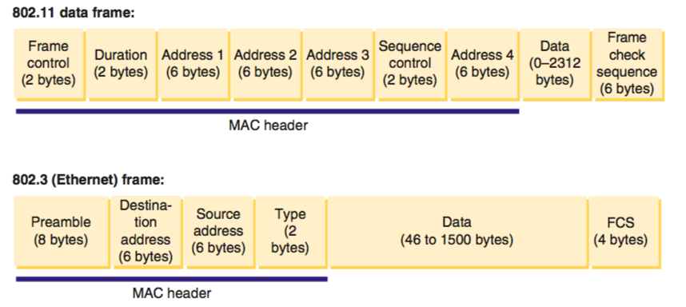

# CSCI 270 Spring 2022
# Chapter 6: Wireless Network

## objective
+ Identify and describe various types of wireless networking characteristics
+ Explain the various wireless standards that support the Internet of Things
+ Explain 802.11 standards and innovations
+ Implement a Wi-Fi network
+ Secure a Wi-Fi network
+ Troubleshoot a Wi-Fi network

## Characteristics of Wireless Transmissions
###  Wireless Transmissions
+ satellite
+ Bluetooth
+ Wi-Fi
+ cellular
+ other wireless signals.

### WLANs(wireless local area networks)
+ LANs that transmit signals through the air via RF (radio frequency) waves.
### LANs vs. WLANs
+ Wired and wireless signals share many similarities, including use of the same Layer 3 and higher protocols.
+ Wireless transmission vastly different from wired transmission at lower OSI layers

### [Lab: Implementation of Wireless LAN](../Labs/CH6-WLAN.md)

### wireless signals
#### Wireless Spectrum
+ The wireless spectrum, commonly called the airwaves, is the frequency range of electromagnetic waves used for data and voice communication.(All wireless signals are carried through the air by electromagnetic waves.)
+ the wireless spetrum spans frequency ranges or bands between 9 kHz and 300 GHz.(A hertz or Hz is one cycle per second.)

|Technologies|Frequency range low|Frequency range high|Description|
|----|----|----|----|
|RFID|125 kHz|134.2 kHz|The lowest of several frequency ranges for RFID and approved for global use|
|NFC|13.56 MHz||Fixed frequency|
|Z-Wave|90.842 MHz||Fixed frequency|
|Cellular|824 MHz|896 MHz|Commonly called the 800 band|
|RFID|858 MHz|930 MHz|One of several bands assigned to RFID|
|Cellular|1850 MHz|1990 MHz|Commonly called the 1900 band|
|Wi-Fi; 802.11b/g/n|2.4 GHz|2.4835 GHz|11 or 14 channels|
|ZigBee|2.4 GHz|2.4835 GHz|16 channels|
|Bluetooth|2.4 GHz|2.4835 GHz|79 channels|
|RFID|2.446 GHz|2.454 GHz|Highest frequency range for RFID|
|ANT1|2.457 GHz||Fixed frequency|
|Wi-Fi; 802.11a/n/ac|5.1 GHz|5.8 GHz|24 channels|
|IR|300 GHz|300,000 GHz|10 channels plus 4 near-infrared channels|

### Channel Management
+ A **band** used by a wireless device is defined by its overall frequency range.
+ To allow multiple devices to share the same band, the band is subdivided into **channels** and channels are further subdivided into **narrowband channels**.
+ two technologies to take advantage of the frequencies within its band to avoid interference:
  - **FHSS (frequency hopping spread spectrum)**
    + Short bursts of data are transmitted on a particular frequency within the band.
    + The next burst goes to the next frequency in the sequence.
    + Frequency hopping can happen hundreds of times a second.
    + FHSS is cheaper to implement than DSSS and performs better than DSSS in crowded, indoor environments.
    
  [Hedy Lamarr](https://en.wikipedia.org/wiki/Hedy_Lamarr)
  
  - **DSSS (direct sequence spread spectrum)**
    + Data streams are divided and encoded into small chunks, called chips.
    + chips are spread over all available frequencies within one of three, wide channels, all at the same time.
    + The process of dividing and encoding the data is called chipping, and the spreading ratio used to transform the data is called the chipping code, which is unique to each device.
    + DSSS uses the available bandwidth more efficiently than FHSS and tends to have a higher throughput.
    
 |Technologies|Channel Management|# of channels|
 |----|----|----|
 |Wi-Fi|DSSS|11/14 in 2.4GHz or 24 in 5 GHz|
 |Bluetooth|FHSS|79|
 |ZigBee|DSSS|16|
 |ANT+|fixed frequency||

+ Even with the frequency spread of FHSS or DSSS to avoid interference, collisions can still happen.
  - Collision is a condition that occurs when two or more computers on a network try to transmit signals at the same time.
+ Each technology has a procedure to follow when it senses a collision.

+ [DSSS vs. FHSS](http://info.bannersalesforce.com/intradoc-cgi/nph-idc_cgi.exe?IdcService=GET_FILE&dDocName=TT_FHSSvsDSSS&RevisionSelectionMethod=Latest&Rendition=web)

### Antennas
+ Wireless signals originate from electrical current traveling along a conductor.
+ The electrical signal travels from the transmitter to an antenna.
+ The antenna emits the signal as a series of electromagnetic waves into the atmosphere.
+ The signal moves through the air until it reaches its destination **with no fixed path**.
+ At the destination, another antenna accepts the signal, and a receiver converts it back to current.
+ Two antennas must be tuned to the same frequency in order to use the same channel.
+ Each type of wireless service requires an antenna specifically designed for that service. 
  - power output
  - frequency
  - radiation pattern
    + unidirectional antenna: Issues wireless signals along a single direction
    + omnidirectional antenna: Issues and receives wireless signals with equal strength and clarity in all directions

### Signal Propagation
+ Propagation refers to the way in which a wave travels from one point to another.
+ **LOS (line of sight)**: Ideally, a wireless signal would travel directly in a straight line from its transmitter to its intended receiver. 
+ **fading**: caused by obstacles.
  - causes the strength of the signal that reaches the receiver to be lower than the transmitted signal’s strength
  - Excessive fading can cause dropped connec-
tions or slow data transmission.
+ **attenuation**: the farther it moves away from the transmission source, the more it weakens.(wireless signal can be amplified by wireless range extender)
  - wireless range extender
  
  
  
+ **interference**: Wireless signal is more vulnerable to noise.
+ **refraction**: As a wave travels into and through a different transmission medium, the wave’s direction, speed, and wavelength are altered, or refracted.
+ **reflection**: The wave encounters an obstacle and reflects, or bounces back, toward its source
+ **scattering**: When a wireless signal encounters an object that has small dimensions compared with the signal’s wavelength, it’s diffused or scattered in multiple directions. 
+ **diffraction**: A wireless signal is diffracted, or split into secondary waves, when
it encounters an obstruction.(caused by objects with sharp edges)

#### summary of multipath signal propagation

+ Wireless signals have a better chance of reaching their destination.
+ Multiple instances of the same signal can arrive at a receiver at different times, which might result in data errors.
+ IEEE’s 802.11 standards, also known as Wi-Fi, to take advantage of the multipath signaling

## Wireless Standards for the IoT (Internet of Things)
### IoT (Internet of Things)
+ is made up of any device that can be connected to the Internet.
  - sensors
  - computers
  - wearable devices
### PAN (personal area network)
+ The purely wireless version is a WPAN (wireless PAN)
+ The standards include short-range wireless technologies such as Bluetooth and ZigBee.
+ PANs rarely exceed about 10 meters in any direction.
+ usually only contain a few personal devices.

|Wireless Technologies/Protocols|Standard|Description|Layer(s)|
|----|----|----|----|
|ZigBee|802.15.4|low-powered, battery-conserving,to handle small amounts of data, ideal for use in ISM (industrial, scientific, and medical) sensors|Layers 1-7|
|Z-Wave||smart home protocol,A Z-Wave network controller, called a hub, receives commands from a smartphone or computer and relays the commands to various smart devices on its network. |Layers 1-7|
|Bluetooth|802.15.1|unites mobile devices, PCs, and accessories under a single communications standard, most Bluetooth devices require close proximity to form a connection.|Layers 1-7|
|ANT1|ANT protocol|gathers and tracks information from sensors,wirelessly sync this data to the person’s smartphone, computer, and web-based accounts|Layers 1-2|
|RFID (Radio Frequency Identification)||uses electromagnetic fields to store data of  1 to 8 KB on a small chip in an RFID tag|Layers 1-2|
|NFC (Near-Field Communication)||a form of RFID and transfers data wirelessly over very short distances (usually 10 cm or less)|Layers 1-2|
|Wireless USB||e.g. wireless USB mouse|Layer 1|
|IR (Infrared)||used to collect data through various sensors|Layer 1|
|Wi-Fi|802.11||Layers 1-2|

## 802.11 WLAN Standards

+ The most popular OSI Physical and Data Link layer standards used by WLANs is Wi-Fi (wireless fidelity).
+ The 802.11 standards vary at the Physical layer: 802.11b, 802.11a, 802.11g, 802.11n, and 802.11ac
  - and [**Wi-Fi 6 (802.11 ax) 2019**](https://www.tp-link.com/us/wifi6/)
  - 802.11n and later standards modify the way frames are used at the `MAC sublayer`, which is the lower portion of the Data Link layer that is specifically involved with managing MAC addresses in message frames.
  - Layer 2’s other sublayer is called the `LLC sublayer`. (“LLC” stands for “logical link control.”) The LLC sublayer is primarily concerned with multiplexing, flow and error control, and reliability.
+ Like 802.3 (Ethernet), 802.11 appends 48-bit physical addresses to a frame to identify its source and destination.

### Access Method
+ [shared medium](https://en.wikipedia.org/wiki/Shared_medium)
+ CSMA/CA (Carrier Sense Multiple Access with Collision Avoidance) 

  - source node
    + Using CSMA/CA, a node on an 802.11 network checks for existing wireless transmissions (the green circle in the following figure) before it begins to send data.
      - If the source node detects no transmission activity on the network, it waits a brief, random amount of time, and then sends its transmission.
      - If the source does detect activity, it waits a brief period of time before checking the channel again.
  
  
  - destination node: 
    + The destination node receives the transmission and, after verifying its accuracy, issues an ACK (acknowledgment) packet to the source.
  - source node
    + If the source receives this acknowledgment, it assumes the transmission was properly completed.
    + If the source node fails to receive acknowledgment from the destination node, it begins the CSMA/CA process anew.
   
+ **hidden node problem**: Nodes that are physically located far apart from each other on a wireless network present a particular challenge in that they are too far apart to collaborate in preventing collisions
  - solution: **RTS/CTS (Request to Send/Clear to Send) protocol**
    + a source node issues an RTS signal to the access point requesting the exclusive opportunity to transmit.
    + If the access point agrees by respond- ing with a CTS signal, the access point temporarily suspends communication with all nodes in its range and waits for the source node to complete its transmission.
    + When used, RTS/CTS decreases network efficiency. However, it can be worthwhile when transmitting large packets.
    
    

### Association
The process of a wireless device getting access to an AP(access point).
+ **scanning**: a turned-on wireless node with running wireless protocols periodically surveys its surroundings for evidence of an access point.
  - active scanning—The wireless client takes the initiative
    + The computer transmits a special frame, known as a probe.
    + An AP detects the probe frame and issues a probe response containing all the information a computer needs to associate with the AP.
    + The computer can agree to associate with that AP.
    + The two nodes begin communicating over the frequency channel specified by the AP.
    
  - passive scanning—The AP takes the initiative:
    + A wireless-enabled computer listens on all channels within its frequency range for a special signal, known as a beacon frame, issued periodically from an AP.
      - A beacon consists of the network's transmission rate and SSID.
    + The computer usually with the consent of the user can choose to associate with the AP.
    + The two nodes agree on a frequency channel and begin communicating.
    
### SSID(service set identifier)
+ a unique character string  used to identify an AP
+ The default SSID often contains the name of the manufacturer and perhaps even the model number of the access point
+ change the default SSID contributes to better security and easier network management
  - Disguise the nature of the network identified by the SSID to avoid giving hackers more information than necessary. 
  - Minimize confusion for employees by using easily recognized though uncommon SSIDs.

#### variations to the standard SSID configuration:
+ BSS (basic service set)—A group of nodes that share an access point.

+ ESS (extended service set)—A group of access points connected to the same LAN. 

#### IEEE 802.11 Frames
+ Address fields are used to indicate Source, Transmitter, Destination, Receiver and BSSID.
+ Isn't "Source" same as "Transmitter"? Isn't "Destination" same as "Receiver"?
  - It depends on the type of frames. They could be same (e.g. in Management frames) or different (in Data frames).
+ Are all the 4 address fields always used?
  - No, they are not. Only Address1 is mandatory. e.g, CTS frame only has Address1. The remaining fields are filled based on the the frame.
+ Address fields are used based on the type of frames: Control, Management and Data.

||Control Frames|Management Frames|Data Frames|
|---|---|---|---|
|Address 1|RA|RA|RA|
|Address 2|TA(not all)|TA|TA|
|Address 3|Not used|BSSID|BSSID or SA or DA|
|Address 4|Not used|Not used|BSSID or SA|

|Field Name|Length|Description|
|----|----|----|
|Address 1|6 bytes|Source address|
|Address 2|6 bytes|Transmitter address|
|Address 3|6 bytes|Receiver address|
|Address 4|6 bytes|Destination address|

Note that: The transmitter and receiver addresses refer to the access point or another intermediary device (if used) on the wireless network.

### 802.11 Innovations
#### Limit
+ half-duplex: a wireless node using one of the 802.11 techniques can either transmit or receive, but cannot do both simultaneously unless the node has more than one transceiver installed.
#### Innovations
+ MIMO (multiple input-multiple output)(802.11n/802.11ac): multiple antennas on the access point and on a client device process incoming or outgoing data simultaneously.

+ MU-MIMO (multiuser MIMO)(802.11ac): allows multiple antennas to service multiple clients simultaneously.

+ channel bonding(802.11n): two adjacent 20-MHz channels can be combined, or bonded, to make a 40-MHz channel.

+ frame aggregation(802.11n): networks can use one of two techniques for combining multiple data frames into one larger frame.

## Implementing a Wi-Fi network

### 1. Wireless topologies
+ **ad hoc** - no AP

+ **infrastructure** - one AP

+ **mesh** - several APs as peers
  - a wireless controller might be used.

#### wireless controller
+ central wireless management is made possible by a lightweight wireless protocol
  - LWAPP(Lightweight Acess Point Protocol)
  - CAPWAP(Control and Provisioning of Wireless Acess Point)
  - Both direct all wireless frames to controller by adding extra header to the frame
+ Wireless controller provides
  - centralized authetication for wireless clients
  - load balancing
  - channel management
  - management of AP redundancy
  - detection of the presence of unthorized APs (rogue APs)

### 2. Wireless LAN Connection 
+ use a fixed link with directional antennas between two APs

+ unidirectional antenna
  - to achieve greate transmission distance
  

### 3. Determine the Design
+ A home or small office LAN
  - ISP signal
  - modem
  - SOHO router
  - where to install the AP
    + distance
    + type and number of obstacles
    + coverage
    + interference
    
+ Larger WLANs
  - a **site survey** first
    + client requirements
    + facility characteristics
    + coverage areas
    + software: AirMagnet by Fluke Networks, inSSIDer by MetaGeek

### 4. Configure Wi-Fi Connectivity Devices
+ a SOHU router
  - Administrator password
  - SSID
  - Whether or not the SSID is broadcast
  - Security options such as type and credentials needed to associated with the AP
  - Whether or not DHCP is used (usually not in case another DHCP server is already designated)
  - introduce it to the internet after the succesful configuratoins above

### 5. Configure Wi-Fi Clients
+ A home or small office
+ Larger WLANs
  - on-boarding
    + Users or network technicians install a specific app, called an agent, on a user’s device, whether the device is a smartphone, laptop, or tablet. This gives the device trusted access to certain portions of the network. 
  - off-boarding
  

## Wi-Fi Network Security
+ By default, the 802.11 standard does not offer any security. 
+ The client only needs to know the access point’s SSID, which many access points broadcast.
+ Preventing APs from broadcasting SSIDs makes them hard to detect, but does not provide true security. Two solutions
  - Authentication
    + can be strengthened by using MAC filtering
  - Encryption
    + WEP(Wired Equivalent Privacy, legacy networking)
    + WPA/WPA2(Wi-Fi Protected Access)
  - additional options
    + many establishments
      - guest network
    + captive portal for a guest network
    
### Security Threats to Wi-Fi Networks
+ war driving
+ war chalking
+ evil twin
+ WPA attack
+ WPS attach

