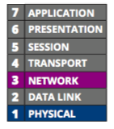

# CSCI 270 Fall 2021
# Chpater 8: Subnet and VLANs

# Objectives
+ Explain the purposes of network segmentation
+ Calculate and implement subnets
+ Explain how VLANs work and how they’re used

# Topics
Network segmentation takes the divide-and-conquer approach to network management. When done well, it increases both performance and security on a network. A network can be segmented physically by creating multiple LANs or logically through the use of VLANs (virtual LANs). 
+ subnets
  - a subnet is a group of IP addresses.
+ VLANs
  - a VLAN is a group of ports on a switch.
  
# Network Segmentation
Network Segmentation can create multiple smaller subnets with their own network traffic and broadcast domain to
+ enhance security
  - Transmissions in broadcast domains are limited to each network so there’s less possibility of hackers or malware reaching remote, protected networks in the enterprise domain.
  - At the same time, other devices, such as a web server, can be made more accessible to the open Internet than the rest of the network.
+ improve performance
  - Segmenting limits broadcast traffic by decreasing the size of each broadcast domain.
+ simplify troubleshooting
  - When troubleshooting, rather than examining the
whole network for errors or bottlenecks, the network administrator can narrow down the problem area to a particular, smaller network.

Networks are commonly segmented according to one of the following groupings
+ geographic locations
  - the floors of a building connected by a LAN
  - the buildings connected by a WAN
+ departmental boundaries
  - the Accounting, Human Resources, and Sales departments
+ device types
  - printers, desktops, and IP phones

Note: Broadcast domain in [Chapter 4](../Slides/Chapter%204.md)
# Subnets

For example: a single LAN with a router and several switches, 192.168.1.0/24

As the network grows, you’ll need to better manage network traffic by segmenting the network so that each floor contains a separate LAN, or broadcast domain. 

+ A router is a broadcast boundary.
+ We need to configure the clients on each subnet.
+ you need to configure each router to ensure that it serves as the default gateway for its LAN and forwards traffic to the other two LANs as necessary.
+ The technique is called **subnetting**.

## subnetting benifits:
+ Network documentation is easier to manage.
+ Problems are easier to locate and resolve.
+ Routers can more easily manage IP address spaces that don’t overlap.
+ Routing is more efficient on larger networks when IP address spaces are mathematically related at a binary level.

## How Subnet Masks Work
+ A device uses a **subnet mask** to determine which subnet or network it belongs to.
+ **network portion/network ID** and **host portion/host ID**
  - example: 192.168.1.2/24
    + network ID: 192.168.1 or **192.168.1.0**
    + host ID: 2 or **0.0.0.2**
+ When a computer is ready to send a transmission to another host
  - it first compares the bits in its own network ID to the bits in the network ID of the destination host.
  - If the bits match, the remote host is on the sending computer’s own network, and it sends the transmission directly to that host.
  - If the bits don’t match, the destination host is on another network, and the computer sends the transmission to the default gateway on its network.
  - The gateway is responsible for sending the transmission toward the correct network.
  
+ example:
  - 192.168.1.1/24 to 192.168.1.2/24
  - 192.168.1.1/24 to 192.168.2.1/24
  - 192.168.1.1/24 to 192.168.1.2/16
  
+ Each network class is associated with a default subnet mask

|Network class|default subnet mask(binary)|number of bits used for network information|default subnet mask(dot decimal)|
|----|----|----|----|
|A|**11111111** 00000000 00000000 00000000|8|**255**.0.0.0|
|B|**11111111 11111111** 00000000 00000000|16|**255.255**.0.0|
|C|**11111111 11111111 11111111** 00000000|24|**255.255.255**.0|

## CIDR (Classless Interdomain Routing)
To determine network bits and host bits, we can use
+ subnet mask, or
+ **CIDR (Classless Interdomain Routing)**: the slash

Note: CIDR is pronounces as cider.

  - example: 192.168.1.1/24, **/24** is known as CIDR block.
## IPv4 Subnet Calculations: classless addressing
example: divide 192.168.1.0/24 into two subnets.
+ step 1: Borrow from host bits
  - convert network ID into binary: **11000000.10101000.00000001**.00000000
  - borrow 1 bit from host bits: **11000000.10101000.00000001.0**0000000, the bit we borrow from host bits can be either 0 or 1.
+ step 2: Determine the subnet mask
  - The first 25 bits are 1s: **11111111.11111111.11111111.1**0000000 or 255.255.255.128
+ step 3: Determine the network IDs
  - subnet 1: **11000000.10101000.00000001.0**0000000 or 192.168.1.0, in CIDR notation: 192.168.1.0/25
  - subnet 2: **11000000.10101000.00000001.1**0000000 or 192.168.1.128, in CIDR notation: 192.168.1.128/25
+ step 4: Determine the ranges of IP addresses
  - subnet 1: **11000000.10101000.00000001.0**0000000 to **11000000.10101000.00000001.0**1111111 or 192.168.1.0 to 192.168.1.127
  - subnet 1: **11000000.10101000.00000001.1**0000000 to **11000000.10101000.00000001.1**1111111 or 192.168.1.128 to 192.168.1
  
  Note that in each subnet, the first IP is used as network ID, the last IP is used as broadcast ID, then
  - in subnet 1, the range of the host ID is from 192.168.1.1 to 192.168.1.126
  - in subnet 2, the range of the host ID is from 192.168.1.129 to 192.168.1.254
  
### What if we divide a network 192.168.1.0/24 into 6 subnets? where 6 is not 2^n(2 to the power of an integer).

+ step 1: Decide how many bits to borrow
  - Find the smallest n which satisfies 2n `>` 6, n=3.
+ step 2: Determine the subnet mask
  - borrow 3 bits from host, change 0 to 1
    + original mask: **11111111.11111111.11111111**.00000000 (255.255.255.0)
    + new mask: **11111111.11111111.11111111.111**00000 (255.255.255.224)
    
+ step 3: Calculate the network ID for each subnet
  - calculate the number of IP addresses in each subnet: 256/8 = 32, where 256 is the number of IP addresses in the original network 192.168.1.0/24 and 8 is the number of the subnets
  - subnet 1 network ID: 192.168.1.0
  - subnet 2 network ID: 192.168.1.0 + 0.0.0.32 = 192.168.1.32
  - subnet 3 network ID: 192.168.1.32 + 0.0.0.32 = 192.168.1.64
  - subnet 4 network ID: 192.168.1.64 + 0.0.0.32 = 192.168.1.96
  - subnet 5 network ID: 192.168.1.96 + 0.0.0.32 = 192.168.1.128
  - subnet 6 network ID: 192.168.1.128 + 0.0.0.32 = 192.168.1.160
  - subnet 7 network ID: 192.168.1.160 + 0.0.0.32 = 192.168.1.192
  - subnet 8 network ID: 192.168.1.192 + 0.0.0.32 = 192.168.1.224
  
+ step 4: Determine the IP address range for each subnet

|subnet|IP range|Network ID|Host range|Broadcast IP|
|----|----|----|----|----|
|1|192.168.1.0 to 192.168.1.31|192.168.1.0|192.168.1.1 to 192.168.1.30|192.168.1.31|
|2|192.168.1.32 to 192.168.1.63|192.168.1.32|192.168.1.33 to 192.168.1.62|192.168.1.63|
|3|192.168.1.64 to 192.168.1.95|192.168.1.64|192.168.1.63 to 192.168.1.94|192.168.1.95|
|4|192.168.1.96 to 192.168.1.127|192.168.1.96|192.168.1.97 to 192.168.1.126|192.168.1.127|
|5|192.168.1.128 to 192.168.1.159|192.168.1.128|192.168.1.129 to 192.168.1.158|192.168.1.159|
|6|192.168.1.160 to 192.168.1.191|192.168.1.160|192.168.1.161 to 192.168.1.190|192.168.1.191|
|7|192.168.1.192 to 192.168.1.223|192.168.1.192|192.168.1.193 to 192.168.1.222|192.168.1.223|
|8|192.168.1.224 to 192.168.1.255|192.168.1.224|192.168.1.225 to 192.168.1.254|192.168.1.255|

Note that: Each time you subnet a network, you lose two possible host addresses with each subnet. This overhead is the price you pay for subnetting a network, in exchange for the advantages you gain.

### VLSM (Variable Length Subnet Mask)/“subnetting a subnet.”
+ Traditional subnetting reduces the waste of IP addresses, but results in multiple subnets that are all the same size.
+ This uniformity in subnet size can be inefficient in complex networks.
+ VLSM (Variable Length Subnet Mask) allows subnets to be further subdivided into smaller and smaller groupings until each subnet is about the same size as the necessary IP address space.

+ example: Subnets of various sizes needed on the network 192.168.10.0/24 

|Subnet|Included hosts|Number of hosts|CIDR notation (as calculated next)|
|----|----|----|----|
|1|Sales|120|192.168.10.0/25|
|2|Accounting|58|192.168.10.128/26|
|3|HR|25|192.168.10.192/27|
|4|IT|6|192.168.10.224/29|
|5|Executives|5|192.168.10.232/29|
|6|WAN link|2|192.168.10.240/29|
|7|WAN link|2|192.168.10.248/29|

  - step 1: Determine the appropriate subnet mask and other network information for the largest subnet. By borrowing one bit from the host bits, we get the following available subnets:
    + Subnet 1: 192.168.10.0 /25
    + Subnet 2: 192.168.10.128 /25
  - step 2: We assign the first of these subnets to the Sales department. Now we can use the second subnet for further calculations.
  - step 3: Determine the appropriate subnet mask and other network information for the next largest subnet. By borrowing one more bit from the host bits, we get the following available subnets:
    + Subnet 2: 192.168.10.128 /26
    + Subnet 3: 192.168.10.192 /26
  - step 4: We assign the first of these subnets to the Accounting department. Now we can use the remaining subnet for further calculations.
  - step 5: Determine the appropriate subnet mask and other network information for the next largest subnet. By borrowing one more bit from the host bits, we get the following available subnets:
    + Subnet 3: 192.168.10.192 /27
    + Subnet 4: 192.168.10.224 /27
  - step 6: We assign the first of these subnets to the Human Resources department. Now we use the other subnet for further calculations.
  - step 7: The next two departments are about the same size, and will each fit within a /29 subnet. By borrowing two more bits from the host bits this time, we get the following available subnets:
    + Subnet 4: 192.168.10.224 /29 
    + Subnet 5: 192.168.10.232 /29 
    + Subnet 6: 192.168.10.240 /29 
    + Subnet 7: 192.168.10.248 /29
  - step 8: We assign the first two of these subnets to the IT department and the Executive suite. Now we use one of the other subnets for further calculations.
  - step 9: The last two required subnets only need two host addresses each, and will each fit within a /30 subnet. By borrowing one more bit from the host bits to further subdivide Subnet 6, and renumbering the remaining space to be Subnet 8 (which will be reserved for future use on our network), we get the following available subnets:
    + Subnet 6: 192.168.10.240 /30 
    + Subnet 7: 192.168.10.244 /30 
    + Subnet 8: 192.168.10.248 /29
  - step 10: We assign each of these subnets to a WAN link, with the final subnet left over for future use.

## VLANs (Virtual Local Area Networks)
### Subnetting vs VLAN
+ a subnet groups IP addresses by adding routers (or Layer 3 switches) to the network or by using multiple ports on a single router (or Layer 3 switch).

+ a VLAN groups ports on a Layer 2 switch.

### Managed Switches vs Unmanaged Switches
#### Unmanaged Switches
+ provide plug-and-play simplicity with minimal configuration options and has no IP address assigned to it.
+ cannot support VLANs.

#### Managed Switches
+ can be configured via a command-line interface or a web-based management GUI.
+  sometimes can be configured in groups.
+ Usually, they are also assigned IP addresses for the purpose of continued management.
+ VLANs can only be implemented through managed switches, whose ports can be partitioned into groups.

#### 802.1Q tag
+ To identify the transmissions that belong to each VLAN, the switch adds a tag to Ethernet frames that identifies the port through which they arrive at the switch. This VLAN identifier is specified in the 802.1Q standard.

#### A VLAN from multiple switches
+ Traffic from one device
on VLAN 1 connected to Switch A can travel to another device on VLAN 1 connected to Switch B as local traffic because they’re in the same VLAN.
+ devices on separate VLANs—even if they’re connected to the same switch— can’t talk to each other without going through the router.

### Switch Ports and Trunks
+ **access port**—Connects the switch to an endpoint. The computer connected to an access port does not know which VLAN it belongs to, nor can it recognize other VLANs on the same switch.
+ **trunk port**—Connects the switch to a router or another switch (or possibly a server). This interface manages traffic from multiple VLANs. A trunk line (or just “trunk”) is a link between two trunk ports.

+ Trunking protocols (such as Cisco’s VTP (VLAN Trunk Protocol)) assign and interpret the VLAN tags in Ethernet frames, thereby managing the distribution of frames through a trunk. 

### VLANs and Subnets
+ **1 broadcast domain = 1 VLAN = 1 subnet**
+ subnet: working at Layer 3
+ vlan: working at Layer 2

+ One router interface is configured to support three different subnets

### Types of VLANs
+ default VLAN
  - Typically preconfigured on a switch and initially includes all the switch’s ports.
  - Ports in the default VLAN can be reassigned to other VLANs.
+ native VLAN
  - Receives all untagged frames from untagged ports. 
  - By default, this is the same as the default VLAN.
  
+ data VLAN/user VLAN
  - Carries user-generated traffic, such as email, web browsing, or database updates.
+ management VLAN
  - Can be used to provide administrative access to a switch.
  
+ voice VLAN
  - Supports VoIP traffic
  
  
[VLAN Lab](../Labs/Ch8-VLAN.md)
