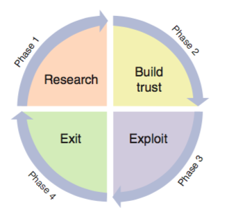
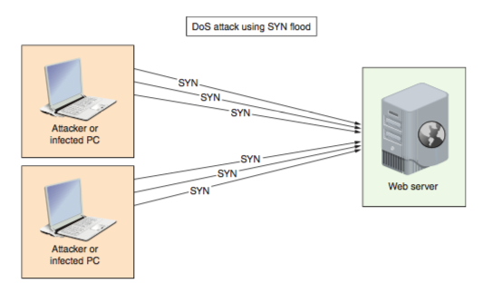
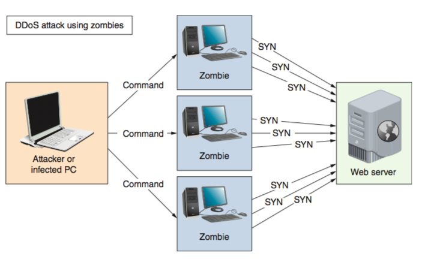
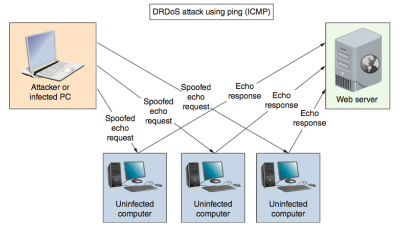
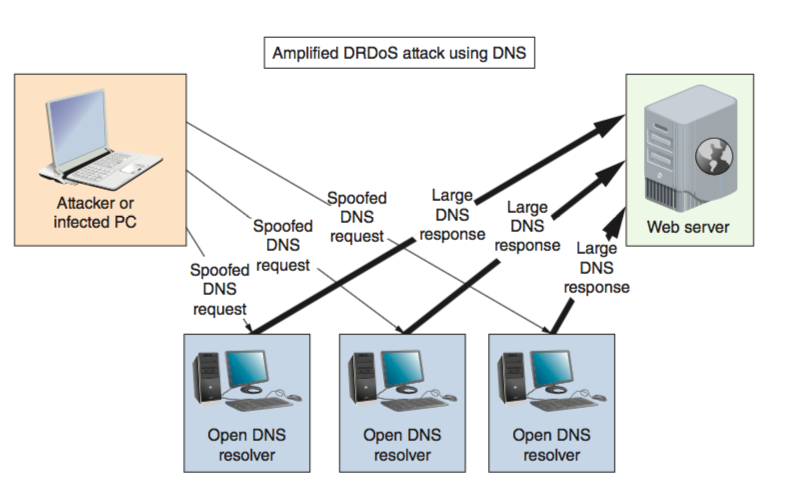
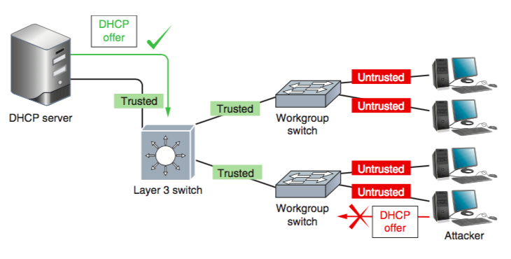

# CSCI 270 Fall 2021
# Chapter 9: Network Risk Management
## Objectives:
+ Identify people, technology, and malware security risks to a network
+ Describe tools used to evaluate the security of a network
+ Discuss physical security methods that prevent and detect intrusions
+ Configure devices on a network for increased security
+ Describe various security policies and explain how they can guide users’ activities on a network

## Security Risks
### Different types of organizations have various levels of network security risks.
+ a large savings and loan institution 
+ a local car wash

### data breach: unauthorized access or use of sensitive data

### terms
+ hacker:
  - originally, someone who masters the inner workings of computer hardware and software in an effort to better understand them.
  - Today, hacker is used more generally to describe individuals who gain unauthorized access to systems or networks with or without malicious intent.
  - can be categorized according to their **intent** and the **prior approval** of the organizations whose networks they’re hacking.
    + white hat hacker:These IT security experts are hired by organizations to assess their security and risks.
    + black hat hacker: These groups or individuals use their skills to bypass security systems to cause damage, steal data, or compromise privacy. 
    + gray hat hacker: These hackers abide by a code of ethics all their own. Although they might engage in illegal activity, their intent is to educate and assist.
+ vulnerability:
  - A weakness of a system, process, or architecture that could lead to compromised information or unauthorized access is known as a vulnerability.
+ exploit:
  - The act of taking advantage of a vulnerability is known as an exploit.
  - zero-day exploit/zero-day attack:
    + one that takes advantage of a software vulnerability that hasn’t yet or has only very recently become public.
    + example: Microsoft's [Patch Tuesday](https://en.wikipedia.org/wiki/Patch_Tuesday)
  - None of the risks discussed in this chapter stand alone. Any risk can open the door to further exploitation.

## People Risks
+ By some estimates, human errors, ignorance, and omissions cause more than half of all security breaches sustained by networks.
+ Taking advantage of people is often an easy way to circumvent network security.
+ End-user awareness and training can be a monumental task that requires regular attention and due diligence. 
+ Ultimately, it is the company’s responsibility to ensure that its employees adhere to applicable standards and policies.
+ An uninformed employee’s inadvertent missteps that cause a data breach can result in extreme litigation expenses for a company.

### social engineering: simply asking users for their passwords

+ **phishing**: An electronic communication that appears to come from a legitimate person or organization and requests access or authentication information.

+ **baiting**:  A malware-infected file, such as a free music download, or device, such as a USB flash drive, is seemingly left unguarded for someone to take and attempt to use on their own computer.

+ quid pro quo: A free gift or service is offered in exchange for private information or “temporary” access to the user’s computer system. 
  - This tactic is surprisingly effective with employees who have not been adequately trained to detect social engineering attempts.
  - The most common quid pro quo attack occurs when a hacker impersonates an IT staffer for a large organization. That hacker attempts to contact via phone the employees of the target organization then offers them some kind of upgrade or software installation.
 

+ tailgating: A person posing as an employee or a delivery or service provider follows an authorized employee into a restricted area. 
+ 
 
 
+ typical social engineering attack cycle
  - Phase 1: research
    + is the most important, and often requires the most time investment. Attackers build familiarity by initially asking for seemingly benign information.
  - Phase 2: building trust.
    +  As they gather more data, they use these tidbits to build trust and gain access to more private information.
  - Phase 3: exploit
    + the victim gives the attacker the access he desires.
  - Phase 4: exit
    +  the attacker executes an exit strategy in such a way that does not leave evidence or raise suspicion. 
 
 
+ The most important defense against social engineering is **employee training**, along with **frequent reminders and tips** regarding the latest scams. 

+ **insider threat**: 
   - An insider is someone who is or was trusted by an organization, such as an employee, former employee, contractor, or other associate.
   - Sometimes trusted people have or develop malicious intent.
   - These attackers pose a particularly high risk to an organization due to their knowledge of the company’s systems, procedures, and layers of security.
+ measures to reduce risks from insiders
  - **Background checks** for new hires and, where relevant, for contractors
  - **Principle of least privilege**, meaning employees and contractors are only given enough access and privileges to do their jobs, and these privileges are terminated
as soon as the person no longer needs them
  - Checks and balances on employee behavior, such as scheduled access,mandatory vacations, and job rotations.
  - **DLP (data loss prevention)** solution that identifies sensitive data on the network
and prevents it from being copied, such as downloading to a flash drive, or transmitted off the network, such as emailing or posting to cloud storage

## Technology Risks
+  security risks inherent in all seven layers of the OSI model.
+  Attacks require more technical sophistication than those that take advantage of human errors.
### types of technology risks
+ spoofing attack: impersonating MAC addresses

+ DoS (denial of service) attack:A DoS (denial-of-service) attack occurs when a legitimate user is unable to access normal network resources, such as a web server, because of an attacker’s intervention. 
  - Most often, this type of attack is achieved by flooding a system with so many requests for services that it can’t respond to any of them.
    
  
  
  - subtypes of Dos:
      + DDoS (distributed DoS) attack: Whereas a DoS attack comes from one or a few sources owned by the attacker, DDoS attacks are orchestrated through many sources.
      + A Zombie is a malicious program that is installed on a device that transforms it into a “zombie” that attacks other systems. 
      
      
      
      + DRDoS (distributed reflection DoS) attack: a DDoS attack bounced off of uninfected computers, called reflectors, before being directed at the target.
      
      
      
      + amplified DRDoS attack: A DRDoS attack can be amplified when conducted using small, simple requests that trigger very large responses from the target
        + Several protocols lend themselves to being used in these kinds of attacks, such as DNS, NTP, ICMP, SNMP, and LDAP.
        
      + PDoS (permanent DoS) attack: A PDoS attack damages a device’s firmware beyond repair.
        + This is called “bricking” the device because it effectively turns the device into a brick.
        + PDoS attacks usually target routers or switches.
      - friendly DoS attack: An unintentional DoS attack, or friendly attack, is not done with malicious intent.
+ DNS poisoning, or DNS spoofing
  - By altering DNS records on a DNS server, an attacker can redirect Internet traffic from a legitimate web server to a phishing website.
+ ARP poisoning
  - ARP maps IP addresses to MAC addresses on the LAN.
  - ARP performs no authentication, and so is highly vulnerable to attack.
+ MitM (man-in-the-middle) attack
  - A MitM (man-in-the-middle) attack relies on intercepted transmissions and can take several forms.
  - In all these forms, a person redirects and captures secure transmissions as they occur.
  
  
  
+ rogue DHCP server
  - A rogue DHCP server running on a client device, however, could be used to implement a MitM attack by configuring the attacker’s IP address as the victim computers’ default gateway. 
  - Alternatively, the attacker could give her IP address as the DNS server and then spoof websites. 
  - **DHCP snooping**: a security feature on switches monitoring DHCP messages. Any switch ports connected to clients are not allowed to transmit DHCP messages that should only come from a trusted DHCP server.
     
+ deauth (deauthentication) attack
  - the attacker sends these faked deauthentication frames to the AP, the client, or both (or as a broadcast to the whole wireless network) to trigger the deauthentication process and knock one or more clients off the wireless network.
  - a Wi-Fi DoS attack 
+ insecure protocols and services: 
  - Certain TCP/IP protocols are inherently insecure. 
    + FTP bounce:When a client running an FTP utility requests data from an FTP server, the client normally specifies its own IP address and FTP’s default port number.
  - HTTP
    + use HTTPS with SSL/TLS instead
  - Telnet
    + use along with IPsec
    + SLIP
      - use PPP instead
  - TFTP
    + use SFTP instead
  - SNMPv1 and SNMPv2
    + use SNMPv3 instead
+ back doors
  - security flaws that allow unauthorized users to gain access to the system.
  - the network administrator needs to perform regular updates.
 ## Malware Risks
 + Malware (short for malicious software) refers to any program or piece of code designed to intrude upon or harm a system or its resources. 
 ### types
 + virus: A program that replicates itself with the intent to infect more computers, either through network connections when it piggybacks on other files or through the exchange of external storage devices. 
 + Trojan horse: A program that disguises itself as something useful but actually harms your system.
    - Trojan horses do not replicate themselves, they are not considered viruses.
 + worm: A program that runs independently of other software and travels between computers and across networks.
    - Worms do not alter other programs in the same way that viruses do,
    - but they can carry viruses. Because they can transport and hide viruses
    - you should be concerned about picking up worms when you exchange files on the Internet, via email, or on flash drives.
 + bot (short for robot): A process that runs automatically, without requiring a person to start or stop it.
    - Bots can be beneficial or malicious.
    - Bots can be used to damage or destroy a computer’s data or system files, issue objectionable content, launch DoS attacks, or open back doors for further infestation. Bots are especially difficult to contain because of their fast, surreptitious, and distributed dissemination.
    
 + ransomware: A program that locks a user’s data or computer system until a ransom is paid. 
    - Currently, the only mostly reliable defense is to make manual backups of data on a regular basis and disconnect the backup media from the computer between backups.
    
    
 
 
 
 #### Certain characteristics can make malware harder to detect and eliminate
 + encryption
    - Most anti-malware software searches files for a recognizable string of characters that identify the virus.
 + stealth
    - Some malware disguises itself as legitimate programs or replaces part of a legitimate program’s code with destructive code.
 + polymorphism
    - Polymorphic malware changes its characteristics (such as the arrangement of bytes, size, and internal instructions) every time it’s transferred to a new system
 + time dependence: Some malware is programmed to activate on a particular date.
 + others
 
 
 ## Security Assessment
 Before spending time and money on network security, first examine your network’s security risks. 
 Consider the effect that a loss or breach of data, applications, or access would have on your network. 
 The more serious the potential consequences, the more attention you need to pay to security. 
 + posture assessment: 
    - Every organization should assess its security risks by conducting a posture assessment.
    - Posture assessment is a thorough examination of each aspect of the network to determine how it might be compromised.
    - The more serious the potential consequences, the more attention you need to pay to security.
    - Posture assessments should be performed at least annually and preferably quarterly.
    - They should also be performed after making any significant changes to the network. 
 + security audit:
    - A qualified consulting company can also assess the security of your network. If the company is accredited by an agency that sets network security standards, the assessment qualifies as a security audit.
    - Security audits might seem expensive, but if your network hosts confidential and critical data, they are well worth the cost.
### Scanning Tools
#### methods
+ security experts often conduct simulated attacks on a network to determine its weaknesses.
+ three types of attack simulations:
  - vulnerability scanning: to identify vulnerabilities without exploit
    + authenticated: the attacker is given the same access to the network as a trusted user would have
    + unauthenticated: the attacker begins on the perimeter of the network, looking for vulnerabilities that do not require trusted user privileges.
  - penetration testing: to find network vulnerabilities, and attempts to exploit those vulnerabilities.
  - red team-blue team exercise: the red team conducts the attack, and the blue team attempts to defend the network.
#### tools
+ Scanning tools discover crucial information about your network:
  - Every available host
  - Services, including applications and versions, running on every host
  - Operating systems running on every host
  - Open, closed, and filtered ports on every host
  - Existence, type, placement, and configuration of firewalls
  - Software configurations
  - Unencrypted, sensitive data
  
+ three populor scanning tools: each of these tools has legitimate uses as well as illegal uses
  - Nmap and the GUI version Zenmap: 
    + to scan large networks quickly and provide information about a network and its hosts.
    + to garther information about hosts and their software.
    + to customize your scan results.
  - Nessus:
    + to performs even more sophisticated vulnerability scans than Nmap
    + Nessus can identify unencrypted, sensitive data, such as credit card numbers, saved on your network’s hosts.
    + The program can run on your network or from off-site servers continuously maintained and updated by the developer.
  - Metasploit
    + penetration testing tool
    + to explore potentially new attack routes
    
### Honeypots and Honeynets
+ Honeypots
  - a decoy system that is purposely vulnerable and filled with what appears to be sensitive (though false) content, such as financial data
  - To fool/nab hackers
  - To gain useful information about hacking behavior
+ honeynet
  - several honeypots might be connected to form a honeynet.
+ softwares:
  - KFSensor (keyfocus.net), Canary (canary.tools), and Honeyd (honeyd.org)

## Physical Security
+ Physical access to all of a network’s critical components must be restricted and controlled. 
  - steal devices
  - directly connect his own computer to unprotected console ports
  - damage or destroy expensive equipment,
  - simply reset these devices by pressing the physical reset button. 
+ Only trusted networking staff should have access to secure computer rooms, data rooms, network closets, storage rooms, entrance facilities, and locked equipment cabinets.
+ only authorized staff should have access to the premises, such as offices and data centers

### Prevention Methods: lock the door.
+  keypad or cipher lock

+ key fob

+ [access badge](https://en.wikipedia.org/wiki/Access_badge)

+ [proximity card](https://en.wikipedia.org/wiki/Proximity_card)

+ biometrics

### Detection Methods
When breaches do occur. The key to protecting sensitive data and systems is to detect intrusions as quickly as possible and be prepared to respond appropriately.
+ motion detection

+ video surveillance

+ tamper detection
  - Many devices that need protection can’t be kept within a secure area. (utility meters, ATM, etc.)
  - Tamper detection sensors on these devices can detect physical penetration, temperature extremes, input voltage variations, input frequency variations, or certain kinds of radiation.
 
 
 
+ asset tracking
  - Asset tracking tags can be used to monitor the movement and condition of equipment, inventory, and people. Whether a simple barcode or a wireless-enabled transmitter, such as the RFID label.
  
  
  
+ planning by asking questions related to physical security checks in your security audit
  - Which rooms contain critical systems or data and must be secured?
  - Through what means might intruders gain access to the facility, computer room, data room, network closet, or data storage areas (including doors, windows, adjacent rooms, ceilings, large vents, temporary walls, hallways, and so on)?
  - How and to what extent are authorized personnel granted entry? Do they undergo background or reference checks? Is their need for access clearly justified? Are their hours of access restricted? Who ensures that lost keys or ID badges are reported?
  - Are employees instructed on how to ensure security after entering or leaving secured areas (for example, by not propping open doors)?
  - Are authentication methods (such as ID badges) difficult to forge or circumvent?
  - Do supervisors or security personnel make periodic physical security checks?
  - Are all combinations, codes, or other access means to computer facilities
protected at all times, and are these combinations changed frequently?
  - What is the plan for documenting and responding to physical security breaches?
## Device Hardening

Besides securing network devices from external tampering, you can take many steps to secure the device from network- or software-supported attacks as well. These practices are called **device hardening**.

### Updates and Security Patches

#### Updates to applications, operating systems, and device firmware 
+ fixing bugs
+ adding new features
+ **closing security gaps**
#### Security Patches
security gaps are often addressed in smaller, more frequent updates called patches. The process of properly managing and applying security patches includes the following:

+ discovery
  - Good documentation will help
    + whether a newly discovered vulnerability and its patch applies to your network, 
    + how extensively the issue affects your systems, 
    + how urgent the change is, and
    + what you’ll need to do to implement the patch correctly.
+ standardization
  - Updating OS and application versions consistently across the network will simplify the change process for future updates.
+ layered security
  - multiple defenses applied to a single network
+ vulnerability reporting
  - Network administrators can also subscribe to reporting services from vendors, third parties, and government organizations.
+ implementation
  - Implementing patches includes validating, prioritizing, testing, and applying them.
+ assessment
  - you evaluate the success of patch implementation and the overall effectiveness of the patch.
    + Was the patch applied everywhere it was needed? 
    + Is it working as expected? 
    + Can you detect any further gaps in security?

+ risk mitigation
  - When it is not possible to apply a patch where needed, to lessen the resulting risk, you should apply other layers of protection to the affected devices and applications.
  
### Administrative Credentials
#### username + password
+ Most devices that can be configured through a management interface come with a default access account.

+ The default credentials are usually simple.
+ Surprisingly, many network administrators—even in large organizations—never take the time to change these credentials to something more difficult to crack.
+ make it a habit to change the default administrative credentials before you do anything else, and record this information in a safe place.
#### ssh
+ Many devices are managed through remote access connections, the most common of which is SSH.
+ SSH keys can be used to authenticate devices making the remote connection.
+ Using SSH keys is more secure than using passwords because a securely encrypted key is more difficult to crack than a password.
+ Generate a new SSH key to replace the default one for security.

#### Many devices offer the option to configure several administrative accounts with varying levels of access.
+ **privileged user account**, which is the most privileged, and security precautions for this type of account include
  - limited use
  - limited location
  - limited duration
  - limited access
  - limited privacy
    + monitored by another account or software.

### Services and Protocols
+ A single mistake on one server (not protecting an open port) can open vulnerabilities on multiple systems.
+ To protect devices from these threats:
  - Use secure protocols, such as SSH and SFTP, instead of insecure protocols, such as Telnet and FTP.
  - Disable any running services on a computer that are not needed. You can Google your OS and “unneeded services” to determine which services are most likely good candidates for disabling.
  -  Minimize the number of startup programs to include only those apps that you really need.
  - Close TCP/IP ports on the local firewall that are not used for ongoing activities
  - Disable unneeded connection technologies, such as Bluetooth, Wi-Fi, NFC, and IR.
  - Remove known networks if they’re no longer needed.
  - Disable or uninstall applications that are no longer needed.

### Hashing
+ hasing can transform data from one format to another.
+ hashed data cannot be decrypted.
+ Hashing is mostly used to ensure data integrity—that is, to verify the data has not been altered.

#### SHA (Secure Hash Algorithm)
+ advantage: its resistance to collisions
  - A collision is when two different data sources result in the same hash
+ What does hashing have to do with device hardening?
  - Passwords are often stored in hashed form to prevent them from being read even if they were to be accessed.
  - Entire files can also be hashed.
  
### Anti-Malware Software
+ choosing the most appropriate anti-malware program for your environment, 
+ monitoring the network, 
+ continually updating the anti-malware program, 
+ educating users.

#### besides anti-malware software
users can typically detect the operational changes without any special software. For example, you might suspect a virus on your system if any of the following symptoms arise:
+ Unexplained increases in file sizes
+ Significant, unexplained decline in system or network performance (for example, a program takes much longer than usual to start or to save a file)
+ Unusual error messages with no apparent cause
+ Significant, unexpected loss of system memory
+ Periodic, unexpected rebooting
+ Fluctuations in display quality

#### where to install the software
+ host-based
+ server-based
+ network-based
+ cloud-based

## Security Policies for Users
A security policy for network users identifies your security goals, risks, levels of authority, designated security coordinator and team members, responsibilities for each team member, and responsibilities for each employee. In addition, it specifies how
to address security breaches

+ BYOD (Bring Your Own Device)
  - BYOA (bring your own application)
  - BYOC (bring your own cloud)
  - BYOT (bring your own technology)
  - CYOD (choose your own device)
+ AUP (Acceptable Use Policy)
  - An AUP (acceptable use policy) explains to users what they can and cannot do while accessing a network’s resources.
  - It also explains penalties for violations, and might describe how these measures protect the network’s security.
  - Some of the restrictions might include the following:
    + Don’t do anything illegal.
    + Don’t try to circumvent network security restrictions.
    + Don’t market products or services to other network users.    Don’t forward spam email.
    + Don’t violate the rights of any person or organization.

    + Don’t violate copyright, trade secret, patent, intellectual property, or other regulations. This includes but is not limited to:
      - Don’t install, use, or distribute pirated materials.
      - Don’t copy, digitize, or distribute copyrighted materials.
    + Don’t export software, technical information, or encryption technology.

    + Always sign off or lock a device when not in use.
    + Use company resources to fulfill job obligations, and not for personal tasks that should be performed outside of business hours using the employee’s own resources.
    + Be aware that activities on the network can be and are monitored and may be formally audited.
    + Immediately report any suspected compromise of confidential data or customer privacy.

+ NDA (Non-Disclosure Agreement)
A security policy should also define what confidential and private means to the organization. 

### Password Policy
Choosing a secure password is one of the easiest and least expensive ways to help guard against unauthorized access. 
+  Always change system default passwords after installing new software or equipment.
+ Do not use familiar information, such as your name, nickname, birth date, anniversary, pet’s name, child’s name, spouse’s name, user ID, phone number, address, favorite color, favorite hobby, or any other words or numbers that others might associate with you.
+ Do not use any word that might appear in a dictionary to avoid dictionary attack.
+ Make the password longer than eight characters—the longer, the better.
  - Choose a combination of letters and numbers
  - Use a combination of uppercase and lowercase letters
  - Add special characters
  - Do not repeat words or number sequences
  - Do not use a single letter, number, or symbol more than twice in succession
  - Do not use easily recognized phrases such as a line from a famous song, poem, or movie
+ Do not write down your password or share it with others, including coworkers or family members. Never store passwords in a web browser. Many browsers store these passwords in plaintext and can be easily hacked.
+ Change your password at least every 60 days or more frequently. If you are a network administrator, establish controls through directory services that force users to change their passwords at least every 60 days.
+ Do not reuse passwords after they have expired.
+ Use different passwords for different applications. For example, choose separate passwords for your email account, online banking, VPN connection, and so on. That way, if someone learns one of your passwords, he won’t be able to use the same information to access all your secured accounts.
+  Make it easier to keep a secure record of long, random passwords by installing and using password management software such as LastPass
or KeePass (keepass.info). These programs can generate unique strings of random letters, numbers, and symbols for each password, and store them securely in an encrypted database which is accessible from multiple devices through a single, master password. This way, users only need to remember one, well-formed password that is sufficiently long and random to help maximize security of their password database.

### Anti-Malware Policy
+   Every computer in an organization should be equipped with malware detection and cleaning software that regularly scans for malware. This software should be centrally distributed and updated to stay current with newly released malware.
+ Users should not be allowed to alter or disable the anti-malware software.
+ Users should know what to do in case their anti-malware program detects malware. For example, you might recommend that the user stop working on his computer, and instead call the help desk to receive assistance in disinfecting the system.
+ An anti-malware team should be appointed to focus on maintaining the anti- malware measures. This team would be responsible for choosing anti-malware software, keeping the software updated, educating users, and responding in case of a significant malware outbreak.
+ Users should be prohibited from installing any unauthorized software on their systems. This edict might seem extreme, but in fact users downloading programs (especially games) from the Internet are a common source of malware. If your organization permits game playing, you might institute a policy in which every game must first be checked for malware and then installed on a user’s system by a technician.
+ System-wide alerts should be issued to network users notifying them of a serious malware threat and advising them how to prevent infection, even if the malware hasn’t been detected on your network yet.

      
      
      
      
      
      
      
      
      
      
      
      
      
      
      
      
      
      
      
